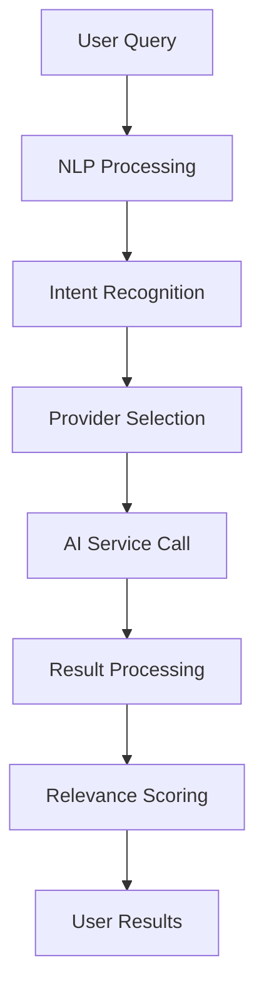

# AI Search Support Team Training

This comprehensive training program equips support team members with the knowledge and skills to effectively handle AI Search-related customer inquiries.

## Training Overview

### Objectives
- Understand AI Search technology and functionality
- Master troubleshooting techniques for common issues
- Develop effective customer communication skills
- Learn escalation procedures and when to use them
- Gain hands-on experience with support tools

### Duration
- Total Training Time: 8 hours
- Session 1: AI Search Fundamentals (2 hours)
- Session 2: Technical Troubleshooting (3 hours)
- Session 3: Customer Communication (2 hours)
- Session 4: Hands-on Practice (1 hour)

### Target Audience
- Customer Support Representatives
- Technical Support Specialists
- Support Team Leads
- Customer Success Managers

## Session 1: AI Search Fundamentals

### 1.1 Technology Overview (45 minutes)

#### What is AI Search?
```markdown
AI Search is an intelligent search system that:
- Uses natural language processing (NLP)
- Understands user intent and context
- Leverages multiple AI service providers
- Provides semantic search capabilities
- Learns from user behavior patterns
```

#### How It Works


#### Key Components
- **Query Processing**: Natural language understanding and intent recognition
- **Provider Management**: Multiple AI service integration (OpenAI, OpenRouter, Anthropic)
- **Result Ranking**: Relevance scoring and result ordering
- **Caching System**: Performance optimization through result caching
- **Analytics Engine**: Usage tracking and performance monitoring

### 1.2 User Interface Navigation (30 minutes)

#### Main Search Interface
```markdown
Components:
- Search input box with natural language support
- Advanced filters (location, beat, publication type)
- Results display with relevance indicators
- Search history and saved searches
- Export and sharing options
```

#### Advanced Features
- **Filter Options**: Location, beat, publication type, contact type
- **Search History**: Recent searches and saved queries
- **Result Actions**: Save contacts, export results, share findings
- **Settings**: User preferences and search customization

#### User Experience Flow
1. User enters natural language query
2. System processes and understands intent
3. Results appear with relevance scores
4. User can refine with filters or modify query
5. Selected contacts can be saved or exported

### 1.3 Common Use Cases (30 minutes)

#### Journalist Research
```markdown
Typical Queries:
- "Technology journalists covering AI startups in Silicon Valley"
- "Fashion writers focusing on sustainable brands"
- "Political reporters for major newspapers in Washington DC"

Support Tips:
- Help users craft specific, effective queries
- Suggest relevant filters to narrow results
- Explain how to evaluate result relevance
```

#### PR Campaign Planning
```markdown
Typical Queries:
- "Business journalists who review new products"
- "Lifestyle bloggers in New York City"
- "Industry analysts covering renewable energy"

Support Tips:
- Guide users to target specific media segments
- Explain how to use geographic and topic filters
- Show how to save and organize results for campaigns
```

#### Content Creation
```markdown
Typical Queries:
- "Experts in artificial intelligence for quotes"
- "Academic researchers studying climate change"
- "Industry thought leaders in fintech"

Support Tips:
- Help users find expert sources and contacts
- Explain how to verify contact credentials
- Show how to export contact information
```

### 1.4 Feature Limitations (15 minutes)

#### Known Limitations
```markdown
- Response time: 15-30 seconds for complex queries
- Result accuracy: Dependent on AI service performance
- Geographic coverage: Limited to available contact data
- Language support: Primarily English queries
- Real-time updates: Not all contact information is current
```

#### Setting User Expectations
- Explain typical response times
- Clarify result accuracy limitations
- Set realistic expectations for data completeness
- Provide alternative search strategies when needed

## Session 2: Technical Troubleshooting

### 2.1 Diagnostic Tools (45 minutes)

#### User Information Checker
```bash
Tool: User Account Diagnostic
Purpose: Verify user access and permissions
Usage: 
1. Enter user ID or email
2. Review account status and permissions
3. Check feature flag assignments
4. Verify billing and usage status

Key Information:
- Account status (active/suspended)
- Feature flag assignments
- Usage limits and billing status
- User segment and permissions
```

#### Search Analytics Dashboard
```bash
Tool: Search Analytics
Purpose: Analyze user search behavior and patterns
Usage:
1. Select user and time range
2. Review search history and performance
3. Identify error patterns and issues
4. Compare with baseline metrics

Key Metrics:
- Search success rate
- Average response time
- Common error types
- Query patterns and effectiveness
```

#### System Status Monitor
```bash
Tool: System Status Dashboard
Purpose: Check overall system health and performance
Usage:
1. Monitor service availability
2. Check AI provider status
3. Review performance metrics
4. Identify ongoing issues

Key Indicators:
- Service uptime and availability
- AI provider response times
- Error rates and system load
- Active issues and resolutions
```

### 2.2 Common Issue Resolution (60 minutes)

#### Issue Category 1: Search Not Working
```markdown
Symptoms:
- No results returned
- Error messages displayed
- Search functionality disabled

Troubleshooting Steps:
1. Verify user account status
2. Check feature flag assignments
3. Test browser compatibility
4. Verify network connectivity
5. Check system status

Resolution Actions:
- Guide user through browser troubleshooting
- Update user permissions if needed
- Escalate to technical team for system issues
- Provide alternative search methods
```

#### Issue Category 2: Slow Performance
```markdown
Symptoms:
- Search takes longer than 30 seconds
- Results load slowly
- Page timeouts during search

Troubleshooting Steps:
1. Analyze query complexity
2. Check system load and performance
3. Verify user's network connection
4. Review AI provider status
5. Check for caching issues

Resolution Actions:
- Suggest query simplification
- Recommend off-peak usage times
- Report performance issues to technical team
- Enable caching features if available
```

#### Issue Category 3: Poor Result Quality
```markdown
Symptoms:
- Results don't match search intent
- Irrelevant or outdated contacts
- Too few or too many results

Troubleshooting Steps:
1. Review query construction
2. Check filter application
3. Verify data quality issues
4. Analyze AI service performance
5. Evaluate user expectations

Resolution Actions:
- Teach effective search techniques
- Suggest specific keywords and filters
- Report data quality issues
- Manage user expectations appropriately
```

#### Issue Category 4: Cost and Usage Concerns
```markdown
Symptoms:
- Unexpected high costs
- Usage limit warnings
- Budget exceeded notifications

Troubleshooting Steps:
1. Review usage patterns
2. Check cost calculations
3. Verify billing accuracy
4. Analyze search efficiency
5. Evaluate cost factors

Resolution Actions:
- Explain cost structure clearly
- Suggest cost-effective search strategies
- Review billing for accuracy
- Recommend usage optimization
```

### 2.3 Advanced Troubleshooting (45 minutes)

#### System Integration Issues
```markdown
Common Problems:
- API integration failures
- Third-party service disruptions
- Database connection issues
- Cache synchronization problems

Diagnostic Approach:
1. Check system logs for errors
2. Verify service connectivity
3. Test individual components
4. Analyze performance metrics
5. Review recent changes

Resolution Strategy:
- Isolate affected components
- Implement temporary workarounds
- Escalate to engineering team
- Document findings and solutions
```

#### Performance Optimization
```markdown
Optimization Techniques:
- Query refinement and simplification
- Filter application strategies
- Caching implementation
- Load balancing consideration

User Guidance:
- Teach efficient query construction
- Demonstrate effective filter usage
- Explain caching benefits
- Provide performance tips
```

#### Data Quality Issues
```markdown
Quality Indicators:
- Outdated contact information
- Inaccurate categorization
- Missing data fields
- Duplicate entries

Reporting Process:
1. Document specific examples
2. Provide context and impact
3. Categorize data quality issues
4. Submit detailed reports
5. Follow up on resolutions
```

### 2.4 Escalation Procedures (30 minutes)

#### When to Escalate
```markdown
Escalation Criteria:
- Issue not resolved after standard troubleshooting
- Technical complexity beyond support scope
- System-wide problems affecting multiple users
- Security or compliance concerns
- Data corruption or loss issues
- Features not working as designed
```

#### Escalation Process
```markdown
Level 1 to Level 2 Escalation:
1. Document all troubleshooting steps
2. Gather detailed issue information
3. Create comprehensive support ticket
4. Notify team lead of escalation
5. Provide preliminary diagnosis

Level 2 to Engineering Escalation:
1. Perform detailed technical analysis
2. Reproduce issue in test environment
3. Provide complete technical documentation
4. Consult with engineering team
5. Participate in resolution testing
```

#### Escalation Communication
```markdown
Internal Communication:
- Clear issue description and impact
- Detailed troubleshooting history
- User information and context
- Priority assessment and urgency
- Expected resolution timeline

User Communication:
- Acknowledge escalation and set expectations
- Provide regular status updates
- Explain technical issues in simple terms
- Offer temporary workarounds when possible
- Confirm resolution and satisfaction
```

## Session 3: Customer Communication

### 3.1 Effective Communication Techniques (45 minutes)

#### Technical Explanation Simplification
```markdown
Principles:
- Avoid technical jargon
- Use analogies and simple examples
- Focus on outcomes rather than processes
- Provide context and relevance

Example:
Instead of: "The NLP pipeline is failing to parse semantic intent"
Say: "The system is having trouble understanding what you're looking for"
```

#### Empathy and Active Listening
```markdown
Key Techniques:
- Acknowledge user frustrations
- Validate user concerns
- Show understanding of impact
- Demonstrate commitment to resolution

Example Phrases:
- "I understand how frustrating it must be when..."
- "I can see why this is important for your work..."
- "Let me make sure I fully understand your situation..."
```

#### Clear Instructions and Guidance
```markdown
Instruction Principles:
- Break down complex steps
- Use numbered or bulleted lists
- Provide visual aids when helpful
- Confirm understanding at each step

Example Structure:
1. First, let's...
2. Next, you'll want to...
3. Finally, we should...
4. Does that make sense so far?
```

### 3.2 Handling Difficult Situations (45 minutes)

#### Frustrated or Angry Customers
```markdown
De-escalation Techniques:
- Stay calm and professional
- Listen actively without interrupting
- Acknowledge their feelings
- Focus on solutions, not blame
- Set realistic expectations

Example Responses:
- "I can understand why you're frustrated. Let's work together to solve this."
- "I appreciate your patience while we work through this issue."
- "Your feedback is important, and I want to make sure we get this right."
```

#### Complex Technical Issues
```markdown
Communication Strategy:
- Acknowledge complexity
- Explain in simple terms
- Provide timeline for resolution
- Offer regular updates
- Escalate when appropriate

Example Approach:
- "This is a more complex technical issue that requires our engineering team's attention."
- "I've escalated this to our technical specialists, and they're working on it now."
- "I'll check back with you in [TIMEFRAME] with an update."
```

#### Managing Expectations
```markdown
Expectation Setting Principles:
- Be honest about limitations
- Provide realistic timelines
- Explain what you can and cannot do
- Offer alternatives when possible
- Follow through on commitments

Example Statements:
- "I can't promise an immediate fix, but I can ensure we're working on it."
- "Based on similar issues, this typically takes [TIMEFRAME] to resolve."
- "While we work on the permanent fix, here's a temporary solution..."
```

### 3.3 Documentation and Follow-up (30 minutes)

#### Issue Documentation
```markdown
Documentation Requirements:
- Clear problem description
- Detailed troubleshooting steps
- Resolution actions taken
- User feedback and satisfaction
- Lessons learned and improvements

Best Practices:
- Document in real-time when possible
- Include specific error messages and screenshots
- Note user reactions and feedback
- Share successful resolutions with team
```

#### Follow-up Procedures
```markdown
Follow-up Types:
- Immediate resolution confirmation
- 24-hour satisfaction check
- Long-term issue monitoring
- Proactive problem prevention

Follow-up Methods:
- Email confirmation of resolution
- Satisfaction surveys
- Phone check-ins for critical issues
- Regular monitoring for recurring problems
```

## Session 4: Hands-on Practice

### 4.1 Scenario-Based Exercises (30 minutes)

#### Scenario 1: Search Performance Issue
```markdown
Customer Situation:
A user reports that AI Search is taking over 45 seconds to return results.

Practice Steps:
1. Use diagnostic tools to check system status
2. Analyze user's search queries and patterns
3. Check for performance-related issues
4. Provide troubleshooting guidance
5. Document the interaction

Learning Objectives:
- Practice using diagnostic tools
- Develop systematic troubleshooting approach
- Improve technical communication skills
```

#### Scenario 2: User Access Problem
```markdown
Customer Situation:
A user cannot access AI Search feature and sees an "access denied" message.

Practice Steps:
1. Verify user account status and permissions
2. Check feature flag assignments
3. Test user access in different browsers
4. Resolve access issues if possible
5. Escalate if technical intervention needed

Learning Objectives:
- Practice user permission troubleshooting
- Learn feature flag management basics
- Develop escalation judgment
```

#### Scenario 3: Cost Concern Resolution
```markdown
Customer Situation:
A user is concerned about unexpected high costs from AI Search usage.

Practice Steps:
1. Review user's usage patterns and costs
2. Explain cost structure and billing
3. Identify cost optimization opportunities
4. Provide guidance on efficient usage
5. Address billing questions

Learning Objectives:
- Practice cost analysis and explanation
- Develop financial communication skills
- Learn optimization recommendation techniques
```

### 4.2 Tool Proficiency Assessment (30 minutes)

#### Diagnostic Tool Usage
```markdown
Assessment Criteria:
- Correct tool selection for issues
- Efficient tool navigation and usage
- Accurate interpretation of results
- Proper documentation of findings

Practice Activities:
- User account diagnostic exercises
- Search analytics interpretation
- System status monitoring
- Performance analysis
```

#### Communication Skill Evaluation
```markdown
Assessment Criteria:
- Clear and empathetic communication
- Effective technical explanation
- Appropriate tone and language
- Active listening and response

Practice Activities:
- Role-play difficult customer interactions
- Technical explanation exercises
- Empathy statement practice
- Resolution confirmation scenarios
```

## Training Materials and Resources

### 1. Reference Guides

#### Quick Reference Card
```markdown
AI Search Support Quick Reference:
- Common issues and solutions
- Diagnostic tool shortcuts
- Escalation criteria and contacts
- Communication templates and examples
```

#### Troubleshooting Checklist
```markdown
Systematic Troubleshooting Steps:
1. Verify user access and permissions
2. Check system status and performance
3. Analyze specific issue patterns
4. Apply targeted solutions
5. Document and follow up
```

#### Communication Templates
```markdown
Template Library:
- Initial response templates
- Resolution confirmation templates
- Escalation notification templates
- Follow-up and satisfaction templates
```

### 2. Ongoing Learning Resources

#### Knowledge Base Articles
- Detailed troubleshooting guides
- Feature explanation articles
- Best practice documentation
- Case studies and examples

#### Video Training Library
- Tool usage demonstrations
- Customer interaction examples
- Technical explanation techniques
- Advanced troubleshooting scenarios

#### Team Collaboration Platform
- Discussion forums for issue resolution
- Knowledge sharing and best practices
- Peer review and feedback
- Continuous improvement suggestions

## Assessment and Certification

### 1. Knowledge Assessment

#### Written Exam (30 minutes)
- AI Search technology understanding
- Troubleshooting process knowledge
- Communication principles
- Escalation procedure awareness

#### Practical Assessment (45 minutes)
- Tool usage proficiency
- Issue resolution capability
- Communication effectiveness
- Documentation quality

### 2. Certification Criteria

#### Basic Certification Requirements
- 90% score on written assessment
- Successful completion of practical assessment
- Positive feedback from role-play exercises
- Completion of all training sessions

#### Advanced Certification Requirements
- 95% score on all assessments
- Demonstration of advanced troubleshooting skills
- Excellence in customer communication
- Contribution to team knowledge base

### 3. Continuous Improvement

#### Skill Development Tracking
- Regular performance assessments
- Customer satisfaction monitoring
- Knowledge contribution recognition
- Career advancement planning

#### Training Updates
- Monthly skill refreshers
- Quarterly feature updates
- Annual comprehensive training
- Continuous learning opportunities

## Support Team Structure

### 1. Team Roles and Responsibilities

#### Frontline Support Representatives
- Handle initial customer inquiries
- Provide basic troubleshooting and guidance
- Document issues and resolutions
- Escalate complex technical issues

#### Technical Support Specialists
- Resolve advanced technical issues
- Perform in-depth system analysis
- Develop troubleshooting procedures
- Mentor frontline representatives

#### Support Team Leads
- Oversee team performance and quality
- Handle escalations and customer issues
- Coordinate with engineering and product teams
- Drive continuous improvement initiatives

### 2. Collaboration and Communication

#### Team Meetings
- Daily standup meetings (15 minutes)
- Weekly team meetings (1 hour)
- Monthly training sessions (2 hours)
- Quarterly strategy reviews (3 hours)

#### Communication Channels
- Team chat platform for real-time collaboration
- Email for formal communications and documentation
- Video conferencing for remote team meetings
- Knowledge base for information sharing

#### Cross-Functional Collaboration
- Regular meetings with engineering team
- Product feedback and improvement suggestions
- Customer insights and market intelligence
- Process optimization and efficiency improvements

## Conclusion

This comprehensive training program equips support team members with the knowledge, skills, and tools needed to provide exceptional support for AI Search users. By completing this training, team members will be able to:

- Understand AI Search technology and functionality
- Effectively troubleshoot common and complex issues
- Communicate clearly and empathetically with customers
- Know when and how to escalate issues appropriately
- Contribute to continuous team improvement

Ongoing learning and development opportunities ensure that support team members stay current with feature updates, technology changes, and best practices in customer support excellence.

## Related Resources

- [AI Search User Guide](../user/ai-search-guide.md)
- [AI Search Issues Guide](ai-search-issues.md)
- [Technical Documentation](../developer/ai-search-api.md)
- [System Status Dashboard](/status/ai-search)
- [Support Knowledge Base](/support/knowledge-base)