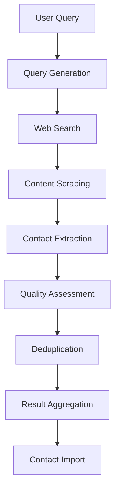

# Find Contacts with AI: Comprehensive Support Guide

## Table of Contents
1. [Feature Overview](#feature-overview)
2. [Technical Architecture](#technical-architecture)
3. [User Interface Components](#user-interface-components)
4. [Common User Issues](#common-user-issues)
5. [Troubleshooting Procedures](#troubleshooting-procedures)
6. [Diagnostic Tools](#diagnostic-tools)
7. [Escalation Procedures](#escalation-procedures)
8. [Support Ticket Templates](#support-ticket-templates)
9. [Customer Communication Templates](#customer-communication-templates)
10. [Internal FAQ](#internal-faq)
11. [Performance Metrics](#performance-metrics)
12. [Feedback Collection Process](#feedback-collection-process)

## Feature Overview

### What is "Find Contacts with AI"?

"Find Contacts with AI" is an advanced search feature that uses artificial intelligence to understand natural language queries and deliver highly relevant media contacts. The feature combines multiple AI services with sophisticated query processing to provide journalists and PR professionals with precise contact discovery.

### Key Capabilities

- **Natural Language Processing**: Understands conversational queries instead of just keywords
- **Multi-Source Discovery**: Searches across multiple data sources simultaneously
- **AI-Powered Extraction**: Identifies contact information from web content in real-time
- **Confidence Scoring**: Provides reliability scores for extracted contacts
- **Duplicate Detection**: Automatically identifies and merges duplicate contacts
- **Real-time Updates**: Shows search progress with detailed status information

### User Workflow

1. User enters a natural language query (e.g., "Technology journalists covering AI startups in California")
2. System generates multiple search queries using AI enhancement
3. Web searches are performed to find relevant sources
4. Content is scraped and analyzed for contact information
5. AI extracts and validates contact details from the content
6. Contacts are scored, deduplicated, and presented to the user
7. User can select and import contacts to their contact database

## Technical Architecture

### Core Components

#### 1. Search Orchestration Service
- **File**: [`src/lib/ai/search-orchestration/search-orchestration-service.ts`](../../src/lib/ai/search-orchestration/search-orchestration-service.ts)
- **Purpose**: Manages the end-to-end search workflow
- **Key Functions**: 
  - Queue management for concurrent searches
  - Progress tracking and real-time updates
  - Error handling and retry logic
  - Performance monitoring

#### 2. Query Generation Service
- **File**: [`src/lib/ai/query-generation/service.ts`](../../src/lib/ai/query-generation/service.ts) 
- **Purpose**: Generates optimized search queries from user input
- **Key Functions**:
  - Template-based query generation
  - AI-powered query enhancement
  - Query scoring and deduplication
  - Coverage optimization across search criteria

#### 3. Contact Extraction Service
- **File**: [`src/lib/ai/contact-extraction/contact-extraction-service.ts`](../../src/lib/ai/contact-extraction/contact-extraction-service.ts)
- **Purpose**: Extracts contact information from web content
- **Key Functions**:
  - Content parsing and quality assessment
  - AI-powered contact identification
  - Email validation and social media detection
  - Confidence scoring and duplicate detection

#### 4. AI Integration Service
- **File**: [`src/lib/ai/integration/aisearch-integration-service.ts`](../../src/lib/ai/integration/aisearch-integration-service.ts)
- **Purpose**: Provides unified interface for frontend components
- **Key Functions**:
  - API request management and optimization
  - Real-time status updates
  - Contact import functionality
  - Batch request processing

### Data Flow



### Integration Points

- **AI Service Providers**: OpenAI, OpenRouter, Anthropic
- **External Search APIs**: Exa, Firecrawl for content retrieval
- **Database**: Prisma ORM for contact storage and retrieval
- **Frontend**: React hooks for state management

## User Interface Components

### 1. Search Interface
- **Location**: Main search page
- **Components**: 
  - Natural language input field
  - Advanced filters (country, category, beat)
  - Search options and preferences
  - Submit and cancel buttons

### 2. Progress Tracking
- **Real-time Updates**: Shows current search stage
- **Stages**:
  - Query Generation (0-20%)
  - Web Search (20-50%)
  - Content Scraping (50-70%)
  - Contact Extraction (70-90%)
  - Result Aggregation (90-100%)

### 3. Results Display
- **Contact Cards**: Name, title, email, confidence score
- **Filtering Options**: Sort by relevance, confidence, source
- **Selection Interface**: Individual or bulk selection
- **Import Options**: Add to contact lists, export data

### 4. Search History
- **Previous Searches**: Access to recent queries
- **Saved Searches**: Store successful queries for reuse
- **Search Analytics**: Usage patterns and performance metrics

## Common User Issues

### 1. Search Not Working

#### Symptoms
- Search returns no results
- Search button is disabled
- Error messages appear when searching
- Search page doesn't load

#### Root Causes
- User access permissions
- Feature flag configuration
- Browser compatibility issues
- Network connectivity problems
- Service availability

### 2. Slow Search Performance

#### Symptoms
- Search takes longer than 30 seconds
- Results load slowly
- Page timeouts during search
- Intermittent slow performance

#### Root Causes
- Complex search queries
- High system load
- AI service provider latency
- Network congestion
- Cache misses

### 3. Poor Quality Results

#### Symptoms
- Results don't match search intent
- Outdated contact information
- Low confidence scores
- Too many or too few results

#### Root Causes
- Vague or ambiguous queries
- Inadequate filtering
- Data quality issues
- AI model limitations
- Source content quality

### 4. Import Failures

#### Symptoms
- Selected contacts won't import
- Error messages during import
- Duplicate contact warnings
- Partial import success

#### Root Causes
- Contact validation failures
- Duplicate detection conflicts
- Database connection issues
- Permission problems
- Data format incompatibilities

## Troubleshooting Procedures

### 1. Initial Assessment

#### Step 1: Verify User Information
```bash
Check:
- User account status and subscription level
- Feature flag assignments
- Usage limits and billing status
- Recent search history and patterns
```

#### Step 2: Reproduce the Issue
```bash
Actions:
- Try the same search with a test account
- Test with different browsers/devices
- Check if issue is query-specific or general
- Verify issue occurs consistently
```

#### Step 3: Check System Status
```bash
Verify:
- AI service provider status
- Database connectivity
- API response times
- Error rates and system load
```

### 2. Common Issue Resolution

#### Search Not Working
1. **Check User Access**: Verify account status and feature flags
2. **Browser Troubleshooting**: Clear cache, check extensions, try different browser
3. **Network Diagnosis**: Check connectivity, DNS, firewall settings
4. **Service Verification**: Confirm AI services are operational
5. **Alternative Access**: Suggest using different search methods

#### Slow Performance
1. **Query Analysis**: Check query complexity and length
2. **System Load**: Verify server capacity and response times
3. **Network Check**: Test user's connection and latency
4. **Cache Status**: Check if caching is working properly
5. **Optimization Suggestions**: Recommend query simplification

#### Poor Results
1. **Query Review**: Analyze search terms and filters used
2. **Data Quality**: Check for outdated or incorrect information
3. **AI Performance**: Verify AI model is functioning correctly
4. **User Education**: Provide tips for better search queries
5. **Feedback Collection**: Document examples for improvement

#### Import Failures
1. **Contact Validation**: Check contact data format and completeness
2. **Duplicate Handling**: Review duplicate detection logic
3. **Database Status**: Verify database connectivity and permissions
4. **Error Analysis**: Examine specific error messages and codes
5. **Manual Workaround**: Offer alternative import methods

### 3. Advanced Troubleshooting

#### System Integration Issues
```bash
Diagnostic Commands:
- Check API response codes and times
- Verify service authentication tokens
- Test individual service components
- Analyze system logs for errors
- Monitor resource utilization
```

#### Performance Optimization
```bash
Optimization Strategies:
- Implement query caching
- Optimize search result ordering
- Reduce unnecessary data transfers
- Implement progressive loading
- Adjust AI model parameters
```

#### Data Quality Problems
```bash
Quality Assurance:
- Implement data validation rules
- Schedule regular data refreshes
- Set up quality monitoring alerts
- Create data correction workflows
- Establish feedback loops with users
```

## Diagnostic Tools

### 1. User Information Checker

#### Tool Location
- **Internal Dashboard**: /support/user-diagnostic
- **API Endpoint**: /api/support/user/[user_id]

#### Key Information
```json
{
  "userId": "string",
  "accountStatus": "active|suspended|trial",
  "subscriptionPlan": "free|professional|enterprise",
  "featureFlags": ["find-contacts-with-ai"],
  "usageStats": {
    "searchesThisMonth": 25,
    "remainingSearches": 75,
    "averageResponseTime": "22s"
  },
  "recentErrors": [
    {
      "timestamp": "2023-10-15T14:30:00Z",
      "error": "TIMEOUT",
      "query": "tech journalists in NYC"
    }
  ]
}
```

### 2. Search Analytics Dashboard

#### Tool Location
- **Internal Dashboard**: /support/search-analytics
- **API Endpoint**: /api/support/analytics/[user_id]

#### Key Metrics
```json
{
  "searchHistory": [
    {
      "searchId": "search_12345",
      "query": "AI technology reporters",
      "timestamp": "2023-10-15T14:30:00Z",
      "status": "completed",
      "duration": "23s",
      "contactsFound": 12,
      "averageConfidence": 0.75
    }
  ],
  "performanceMetrics": {
    "averageResponseTime": "22s",
    "successRate": 0.95,
    "commonErrors": ["TIMEOUT", "NO_RESULTS"]
  }
}
```

### 3. System Status Monitor

#### Tool Location
- **Internal Dashboard**: /support/system-status
- **API Endpoint**: /api/support/system-status

#### Health Indicators
```json
{
  "services": {
    "queryGeneration": "healthy",
    "webSearch": "healthy",
    "contentScraping": "degraded",
    "contactExtraction": "healthy"
  },
  "aiProviders": {
    "openai": "healthy",
    "openrouter": "healthy",
    "anthropic": "healthy"
  },
  "performance": {
    "averageResponseTime": "22s",
    "errorRate": 0.05,
    "activeSearches": 15,
    "queueSize": 3
  }
}
```

## Escalation Procedures

### Level 1: Frontline Support

#### Scope of Authority
- Basic troubleshooting and user guidance
- Account access and permission issues
- Common technical problems
- User education and training

#### Escalation Criteria
- Issue not resolved after 3 attempts
- Technical complexity beyond basic knowledge
- System-wide problems affecting multiple users
- Security or compliance concerns
- Data corruption or loss suspected

#### Escalation Process
1. Document all troubleshooting steps taken
2. Gather relevant user information and error details
3. Create support ticket with detailed information
4. Notify team lead of escalation
5. Provide preliminary diagnosis and impact assessment

### Level 2: Technical Support

#### Scope of Authority
- Advanced technical troubleshooting
- System configuration and integration
- API and developer support
- Performance optimization
- Feature flag management

#### Escalation Criteria
- Issues requiring engineering intervention
- System architecture problems
- Security vulnerabilities
- Data corruption or loss
- Feature not working as designed

#### Escalation Process
1. Perform detailed technical analysis
2. Reproduce issue in test environment
3. Consult with engineering team
4. Prepare detailed technical report
5. Implement temporary workarounds if possible

### Level 3: Engineering/Development

#### Scope of Authority
- Code-level debugging and fixes
- System architecture changes
- Feature enhancements
- Security patches
- Database modifications

#### Resolution Process
1. Prioritize issue based on impact and urgency
2. Assign to appropriate engineering team
3. Develop and test solution
4. Deploy fix with appropriate rollout strategy
5. Monitor for regressions or new issues

## Support Ticket Templates

### 1. Initial Response Template

```
Subject: Re: Find Contacts with AI Issue - Ticket #[TICKET_NUMBER]

Dear [USER_NAME],

Thank you for contacting us about the "Find Contacts with AI" issue you're experiencing. 
I understand you're having trouble with [BRIEF_DESCRIPTION_OF_ISSUE].

I'm here to help you resolve this quickly. To get started, I'd like to ask a few questions:

1. What browser are you using? (Please ensure it's updated to the latest version)
2. Can you describe the exact steps you take when the issue occurs?
3. Are you seeing any error messages? If so, what do they say?
4. What specific query were you trying when the issue occurred?

In the meantime, please try these quick troubleshooting steps:
- Clear your browser cache and cookies
- Try using a different browser (Chrome, Firefox, Safari)
- Check if you have a stable internet connection
- Try a simpler search query to see if the issue persists

I'll review your responses and get back to you with a solution within [RESPONSE_TIME].

Best regards,
[SUPPORT_AGENT_NAME]
Customer Support Team
```

### 2. Technical Issue Template

```
Subject: Technical Investigation: Find Contacts with AI - Ticket #[TICKET_NUMBER]

Issue Details:
- User ID: [USER_ID]
- Account Type: [ACCOUNT_TYPE]
- Issue Type: [ISSUE_CATEGORY]
- Severity: [SEVERITY_LEVEL]
- First Reported: [DATE_TIME]

Description:
[DETAILED_ISSUE_DESCRIPTION]

Steps to Reproduce:
1. [STEP_1]
2. [STEP_2]
3. [STEP_3]

Error Messages:
[EXACT_ERROR_MESSAGES]

Environment Information:
- Browser: [BROWSER_VERSION]
- Operating System: [OS_VERSION]
- Network: [NETWORK_TYPE]
- Location: [USER_LOCATION]

Troubleshooting Attempted:
[DIAGNOSTIC_STEPS_TAKEN]

Impact Assessment:
[USER_IMPACT_DESCRIPTION]

Required Resolution Time: [TIMEFRAME]
```

### 3. Escalation Template

```
Subject: Escalation: Find Contacts with AI Issue - Ticket #[TICKET_NUMBER]

Dear [ESCALATION_TEAM],

I'm escalating ticket #[TICKET_NUMBER] regarding [ISSUE_DESCRIPTION].

User Information:
- User ID: [USER_ID]
- Account Type: [ACCOUNT_TYPE]
- Issue Severity: [SEVERITY_LEVEL]
- Impact on User: [IMPACT_DESCRIPTION]

Troubleshooting Steps Taken:
[DETAILED_STEPS_WITH_RESULTS]

Issue Details:
[TECHNICAL_DETAILS]
[ERROR_MESSAGES]
[REPRODUCTION_STEPS]

System Status at Time of Issue:
[SYSTEM_STATUS_INFORMATION]

Customer Impact:
- Number of affected users: [COUNT]
- Business impact: [BUSINESS_IMPACT]
- User sentiment: [USER_SENTIMENT]

Please investigate and provide a resolution by [EXPECTED_RESOLUTION_TIME].

Best regards,
[SUPPORT_AGENT_NAME]
Customer Support Team
```

### 4. Resolution Template

```
Subject: Re: Find Contacts with AI Issue - Ticket #[TICKET_NUMBER] - RESOLVED

Dear [USER_NAME],

Great news! I've resolved the "Find Contacts with AI" issue you were experiencing.

[SOLUTION_DETAILS]

The issue was caused by [ROOT_CAUSE]. To prevent this from happening again, I recommend:
[PREVENTION_TIPS]

I've also:
[ADDITIONAL_ACTIONS_TAKEN]

If you experience any further issues or have questions about using "Find Contacts with AI," 
please don't hesitate to contact us. We're here to help 24/7.

Is there anything else I can help you with today?

Best regards,
[SUPPORT_AGENT_NAME]
Customer Support Team
```

## Customer Communication Templates

### 1. Email Templates

#### Initial Response Email
```
Subject: We're investigating your Find Contacts with AI issue (Ticket #[TICKET_NUMBER])

Dear [USER_NAME],

Thank you for reaching out about the issue you're experiencing with our Find Contacts with AI feature. 
I've received your report and our team is now looking into it.

Here's what you can expect:
- Initial investigation within [TIMEFRAME]
- Regular updates on our progress
- A resolution as quickly as possible

In the meantime, you might find these resources helpful:
- Find Contacts with AI User Guide: [LINK]
- Frequently Asked Questions: [LINK]
- Video Tutorial: [LINK]

If you have any additional information that might help us resolve this issue faster, 
please reply to this email with details.

Thank you for your patience as we work to resolve this for you.

Best regards,
[SUPPORT_AGENT_NAME]
Customer Support Team
```

#### Progress Update Email
```
Subject: Update on your Find Contacts with AI issue (Ticket #[TICKET_NUMBER])

Dear [USER_NAME],

I wanted to provide you with an update on the issue you reported with Find Contacts with AI.

Current Status:
[STATUS_UPDATE]

What we've done so far:
[ACTIONS_TAKEN]

Next steps:
[NEXT_STEPS]

Estimated resolution time: [TIMEFRAME]

If you have any questions or need anything in the meantime, please don't hesitate to reach out.

Best regards,
[SUPPORT_AGENT_NAME]
Customer Support Team
```

#### Resolution Email
```
Subject: Your Find Contacts with AI issue has been resolved (Ticket #[TICKET_NUMBER])

Dear [USER_NAME],

I'm happy to inform you that the issue you reported with Find Contacts with AI has been resolved.

Issue Summary:
[ISSUE_SUMMARY]

Resolution Details:
[RESOLUTION_DETAILS]

You should now be able to:
[WHAT_USER_CAN_DO_NOW]

To help us improve, we'd appreciate it if you could take a moment to provide feedback on your support experience:
[FEEDBACK_LINK]

If you experience any further issues or have questions about the resolution, please reply to this email.

Thank you for your patience and for bringing this to our attention.

Best regards,
[SUPPORT_AGENT_NAME]
Customer Support Team
```

### 2. Chat Templates

#### Initial Greeting
```
Hello! I'm [AGENT_NAME] and I'm here to help you with your Find Contacts with AI issue. 
Could you please tell me what problem you're experiencing today?
```

#### Information Gathering
```
Thank you for that information. To help me better understand the issue, could you please:

1. Share the specific query you were trying
2. Let me know what browser and device you're using
3. Describe any error messages you're seeing
4. Tell me when this issue started occurring

This will help me diagnose the problem more quickly.
```

#### Troubleshooting Steps
```
Based on what you've described, let's try a few troubleshooting steps:

1. First, let's clear your browser cache and cookies
2. Then, please try using a different browser
3. If that doesn't work, let's test with a simpler search query

Let me know how each of these steps works for you, and we'll continue from there.
```

#### Resolution Confirmation
```
I'm glad we were able to resolve the issue for you! 

To summarize what we did:
[RESOLUTION_STEPS]

Is everything working as expected now? If you have any other questions or if the issue returns, 
please don't hesitate to reach out again.

Thank you for your patience while we worked through this together!
```

### 3. Phone Scripts

#### Opening Script
```
"Thank you for calling [COMPANY_NAME] support. My name is [AGENT_NAME]. 
I understand you're having an issue with our Find Contacts with AI feature. 
Can you please describe the problem you're experiencing?"
```

#### Troubleshooting Script
```
"I understand how frustrating this must be. Let's work through this step by step.

First, let's check if it's a browser issue by clearing your cache and cookies. 
I can guide you through this process if needed.

If that doesn't resolve it, we'll try a different approach. I'm here with you 
until we get this sorted out."
```

#### Closing Script
```
"I'm glad we were able to resolve your issue today. 

Just to recap, we [RESOLUTION_STEPS]. 

Is there anything else I can help you with regarding Find Contacts with AI or any other features?

Thank you for your patience, and please don't hesitate to call us again if you need anything in the future."
```

## Internal FAQ

### General Questions

**Q: What exactly is Find Contacts with AI?**
A: Find Contacts with AI is an advanced search feature that uses artificial intelligence to understand natural language queries and find relevant media contacts. It goes beyond simple keyword matching to understand user intent and provide more accurate results.

**Q: How does the AI component work?**
A: The system uses multiple AI models to process user queries, generate search terms, extract contact information from web content, and score the quality and relevance of contacts. It combines multiple AI service providers for optimal performance.

**Q: What are the typical search response times?**
A: Most searches complete within 15-30 seconds, but complex queries or high system load can extend this to 45-60 seconds. Simple queries might complete in as little as 10 seconds.

### Technical Questions

**Q: What AI service providers does the feature use?**
A: The system integrates with OpenAI, OpenRouter, and Anthropic for various aspects of query processing and contact extraction. The specific provider used depends on the task and current system configuration.

**Q: How is contact information validated?**
A: The system performs multiple validation steps including email format checking, domain verification, social media profile validation, and confidence scoring based on source credibility.

**Q: What happens when a search fails?**
A: Failed searches are automatically retried with different parameters. If all attempts fail, the system logs the error and provides the user with specific error information and suggestions for improvement.

### Troubleshooting Questions

**Q: A user reports getting no results for a valid search query. What should I check first?**
A: First verify the user's account status and feature flags. Then check if the query is too specific or complex. Next, verify system status and AI service availability. Finally, try reproducing the issue with a test account.

**Q: What causes slow search performance?**
A: Common causes include complex queries, high system load, AI service provider latency, network congestion, or cache misses. Check system performance metrics and user's network connection.

**Q: How do I handle a user who is frustrated with search results quality?**
A: First acknowledge their frustration and validate their concerns. Then help them refine their search query with more specific terms and appropriate filters. Document examples of poor results for the engineering team to analyze.

### Billing Questions

**Q: How is the feature billed?**
A: Find Contacts with AI uses a credit-based system where each search consumes one credit. Credit allocation varies by subscription plan: Free (10/month), Professional (100/month), Enterprise (unlimited).

**Q: What happens if a user exceeds their credit limit?**
A: Users receive notifications at 80% and 100% of their limit. Once exceeded, they cannot perform additional searches until the next billing cycle or unless they upgrade their plan.

**Q: Are credits refunded for failed searches?**
A: Credits are not automatically refunded for failed searches, but support agents can issue manual refunds for technical issues beyond the user's control.

### Security Questions

**Q: How is user data protected?**
A: All data is encrypted in transit and at rest. User queries and results are not shared with third parties beyond what's necessary for AI processing. Contact information is stored securely with access controls.

**Q: Can users export their search history?**
A: Users can view their search history within the platform and export individual search results. Full search history export is available upon request through the privacy portal.

## Performance Metrics

### 1. Support Team Metrics

#### Response Time
- **First Response Time**: Target < 2 hours, Critical < 1 hour
- **Resolution Time**: Target < 24 hours, Critical < 4 hours
- **Escalation Time**: Target < 4 hours, Critical < 2 hours

#### Quality Metrics
- **Customer Satisfaction Score**: Target > 4.5/5.0, Minimum 4.0/5.0
- **First Contact Resolution Rate**: Target > 80%, Minimum 70%
- **Escalation Rate**: Target < 15%, Maximum 25%
- **Ticket Reopen Rate**: Target < 5%, Maximum 10%

#### Efficiency Metrics
- **Tickets per Agent per Day**: Target 15-25
- **Average Handling Time**: Target 10-15 minutes
- **Knowledge Base Usage Rate**: Target > 60%
- **Tool Utilization**: Target > 80%

### 2. User Experience Metrics

#### Issue Resolution
- **Issue Resolution Rate**: Target > 95%, Minimum 90%
- **Recurring Issue Rate**: Target < 5%
- **User Satisfaction with Support**: Target > 4.5/5.0
- **Time to Resolution**: Target < 24 hours

#### Self-Service
- **Knowledge Base Usage**: Target > 40%
- **Self-Service Resolution Rate**: Target > 30%
- **Video Tutorial Completion Rate**: Target > 25%
- **FAQ Effectiveness**: Target > 50%

### 3. Feature-Specific Metrics

#### Search Performance
- **Search Success Rate**: Target > 95%
- **Average Search Response Time**: Target < 30 seconds
- **Search Accuracy**: Target > 85% relevance
- **Contact Validation Rate**: Target > 90%

#### User Adoption
- **Feature Usage Rate**: Track active users/total users
- **Search Frequency**: Average searches per user per week
- **Import Rate**: Percentage of search results imported
- **Retention Rate**: Users who continue using feature after initial use

## Feedback Collection Process

### 1. Customer Feedback Channels

#### Post-Interaction Surveys
- **Timing**: Immediately after ticket resolution
- **Method**: Email with link to survey
- **Incentive**: Optional entry into monthly prize draw
- **Metrics**: CSAT, NPS, agent performance

#### In-Product Feedback
- **Location**: Search results page and import confirmation
- **Method**: Simple rating system with optional comments
- **Trigger**: After successful search or import
- **Metrics**: Search satisfaction, result quality, ease of use

#### Quarterly User Interviews
- **Participants**: Random selection of active users
- **Method**: 30-minute video interviews
- **Topics**: Feature usage, pain points, improvement suggestions
- **Compensation**: Account credit or gift card

### 2. Internal Feedback Processes

#### Team Meetings
- **Frequency**: Weekly team meetings, monthly retrospectives
- **Topics**: Common issues, knowledge gaps, process improvements
- **Documentation**: Meeting notes with action items
- **Follow-up**: Tracking of action item completion

#### Quality Reviews
- **Frequency**: Monthly ticket reviews
- **Participants**: Support team members, team lead
- **Focus**: Communication quality, technical accuracy, efficiency
- **Outcome**: Individual feedback and team training recommendations

### 3. Feedback Analysis and Action

#### Data Collection
```json
{
  "feedbackSources": [
    "support_tickets",
    "surveys",
    "in_app_ratings",
    "user_interviews"
  ],
  "collectionMethods": [
    "automated_surveys",
    "manual_review",
    "sentiment_analysis",
    "categorization"
  ]
}
```

#### Analysis Process
1. **Categorization**: Group feedback by topic, severity, and feature
2. **Trend Identification**: Look for patterns and recurring themes
3. **Prioritization**: Rank issues by impact and frequency
4. **Root Cause Analysis**: Identify underlying causes
5. **Action Planning**: Develop specific improvement plans

#### Implementation Process
1. **Stakeholder Approval**: Get buy-in from relevant teams
2. **Resource Allocation**: Assign team members and timeline
3. **Implementation**: Execute improvement plans
4. **Monitoring**: Track effectiveness of changes
5. **Communication**: Inform users about improvements

### 4. Continuous Improvement Framework

#### Monthly Review Cycle
- **Week 1**: Collect and analyze feedback data
- **Week 2**: Identify trends and prioritize issues
- **Week 3**: Develop action plans and get approvals
- **Week 4**: Implement changes and monitor results

#### Quarterly Strategic Review
- **Comprehensive analysis** of all feedback channels
- **Long-term improvement planning**
- **Resource allocation and budget planning**
- **Cross-team collaboration opportunities**

#### Annual Program Assessment
- **Overall effectiveness measurement**
- **ROI analysis of improvement initiatives**
- **Strategic goal setting for next year**
- **Team performance evaluation and recognition**

---

## Related Documentation

- [Find Contacts with AI User Guide](../user/find-contacts-with-ai-guide.md)
- [Find Contacts with AI FAQ](../user/find-contacts-with-ai-faq.md)
- [Technical Documentation](../developer/find-contacts-with-ai-api.md)
- [Monitoring Guide](../production/monitoring.md)
- [Feature Flag Management](../production/feature-flags.md)
- [Post-Launch Monitoring Plan](../production/post-launch-monitoring-plan.md)

---

*Last updated: October 11, 2023*  
*For the most current information, check the internal knowledge base or contact the support team lead.*