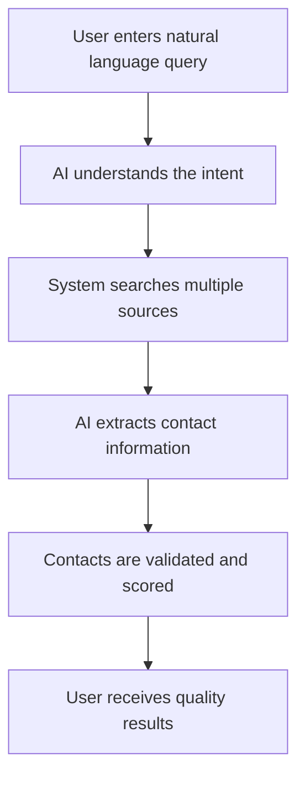
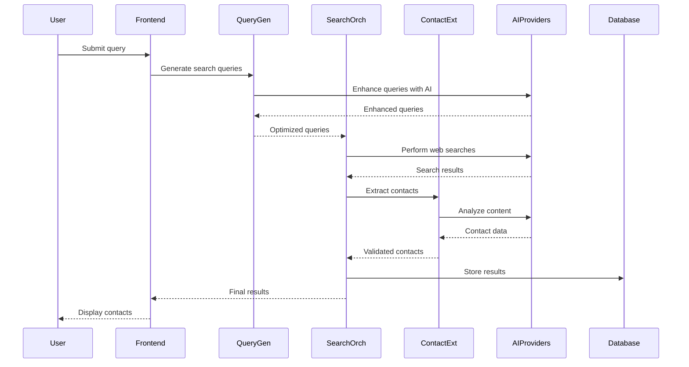

# Find Contacts with AI: Support Team Training Program

## Table of Contents
1. [Training Overview](#training-overview)
2. [Module 1: Feature Fundamentals](#module-1-feature-fundamentals)
3. [Module 2: Technical Deep Dive](#module-2-technical-deep-dive)
4. [Module 3: Troubleshooting Workshop](#module-3-troubleshooting-workshop)
5. [Module 4: Customer Communication](#module-4-customer-communication)
6. [Module 5: Hands-On Practice](#module-5-hands-on-practice)
7. [Assessment and Certification](#assessment-and-certification)
8. [Training Resources](#training-resources)
9. [Continuous Learning](#continuous-learning)

## Training Overview

### Program Objectives

By the end of this training program, support team members will be able to:

1. **Explain the "Find Contacts with AI" feature** to customers in clear, simple terms
2. **Navigate the technical architecture** to diagnose and resolve issues
3. **Use diagnostic tools effectively** to identify root causes
4. **Provide excellent customer support** with empathy and technical accuracy
5. **Escalate issues appropriately** with proper documentation
6. **Contribute to continuous improvement** of support processes

### Target Audience

- **Primary**: Customer Support Representatives
- **Secondary**: Technical Support Specialists
- **Tertiary**: Customer Success Managers and Support Team Leads

### Training Structure

- **Total Duration**: 12 hours
- **Format**: Blend of instructor-led sessions, hands-on labs, and role-playing
- **Delivery**: In-person or virtual instructor-led training
- **Prerequisites**: Basic understanding of the platform, customer service experience

### Schedule

| Module | Duration | Delivery Format |
|--------|----------|-----------------|
| Module 1: Feature Fundamentals | 2 hours | Instructor-led |
| Module 2: Technical Deep Dive | 3 hours | Instructor-led |
| Module 3: Troubleshooting Workshop | 3 hours | Hands-on lab |
| Module 4: Customer Communication | 2 hours | Role-playing |
| Module 5: Hands-On Practice | 2 hours | Simulation |

## Module 1: Feature Fundamentals

### Learning Objectives

- Understand what "Find Contacts with AI" does and how it works
- Explain the value proposition to different user segments
- Navigate the user interface and key features
- Identify common use cases and workflows

### Session Outline

#### 1.1 Feature Overview (45 minutes)

##### What is "Find Contacts with AI"?

**Key Talking Points**:
- It's an intelligent search system that uses AI to understand natural language
- It goes beyond keyword matching to understand user intent
- It discovers contacts from multiple sources in real-time
- It validates and scores contacts for quality and relevance

**Analogy for Customers**:
> "Think of it as having a research assistant who instantly reads hundreds of articles, websites, and databases to find the exact contacts you need, then verifies that the information is accurate and up-to-date."

##### How It Works - Simplified Flow

##### Key Benefits for Different Users

**Journalists**:
- Find expert sources quickly
- Discover new contacts in their beat
- Save time on research

**PR Professionals**:
- Identify relevant media contacts
- Build targeted media lists
- Track coverage opportunities

**Content Creators**:
- Find experts for quotes
- Research industry influencers
- Discover collaboration opportunities

#### 1.2 User Interface Walkthrough (45 minutes)

##### Main Search Interface

**Components to Demonstrate**:
1. **Search Input Field**: 
   - Accepts natural language queries
   - Provides query suggestions
   - Shows search history

2. **Advanced Filters**:
   - Geographic location
   - Industry categories
   - Media beats
   - Publication types

3. **Search Options**:
   - AI enhancement toggle
   - Result quantity preferences
   - Confidence thresholds

##### Progress Tracking

**What Users See**:
- Real-time progress bar with stages
- Estimated time remaining
- Current operation being performed
- Option to cancel search

##### Results Display

**Key Elements**:
- Contact cards with key information
- Confidence scores and validation status
- Source attribution and credibility indicators
- Bulk selection and import options

##### Import and Export

**Available Actions**:
- Add selected contacts to existing lists
- Create new contact lists
- Export results in various formats (CSV, Excel)
- Share findings with team members

#### 1.3 Common Use Cases (30 minutes)

##### Case Study 1: PR Campaign Launch

**Scenario**: A tech startup is launching a new AI product and needs to reach technology journalists.

**Sample Query**: "Technology journalists covering artificial intelligence and machine learning startups in Silicon Valley and New York"

**Expected Results**:
- 15-25 relevant journalists
- Email addresses and publication information
- Confidence scores above 0.7
- Recent articles mentioning AI startups

##### Case Study 2: Expert Sourcing

**Scenario**: A content writer needs experts on sustainable energy for an article.

**Sample Query**: "Renewable energy experts specializing in solar power with academic credentials"

**Expected Results**:
- Academic researchers and industry experts
- Institutional affiliations
- Publication history
- Contact information

##### Case Study 3: Competitive Analysis

**Scenario**: A PR team wants to understand who covers their competitors.

**Sample Query**: "Journalists who have written about Company X or Company Y in the last 6 months"

**Expected Results**:
- Relevant journalists and their publications
- Article links and publication dates
- Contact information
- Coverage patterns

## Module 2: Technical Deep Dive

### Learning Objectives

- Understand the technical architecture behind the feature
- Identify key components and their interactions
- Recognize potential failure points in the system
- Interpret technical error messages and logs

### Session Outline

#### 2.1 System Architecture (60 minutes)

##### Core Components

**Search Orchestration Service** (`src/lib/ai/search-orchestration/search-orchestration-service.ts`):
- Manages end-to-end search workflow
- Handles queue management for concurrent searches
- Provides real-time progress updates
- Implements error handling and retry logic

**Query Generation Service** (`src/lib/ai/query-generation/service.ts`):
- Transforms natural language into optimized search queries
- Uses AI to enhance and diversify queries
- Applies deduplication to eliminate redundant searches
- Scores queries for likely effectiveness

**Contact Extraction Service** (`src/lib/ai/contact-extraction/contact-extraction-service.ts`):
- Identifies contact information in web content
- Validates email addresses and social media profiles
- Calculates confidence and quality scores
- Detects and handles duplicate contacts

**AI Integration Service** (`src/lib/ai/integration/aisearch-integration-service.ts`):
- Provides unified interface for frontend components
- Manages API requests to AI service providers
- Handles real-time status updates
- Optimizes request batching and caching

##### Data Flow Process

##### AI Service Integration

**Multiple AI Providers**:
- **OpenAI GPT-4**: Primary model for query enhancement and content analysis
- **OpenRouter**: Backup provider with access to multiple models
- **Anthropic Claude**: Alternative for specific content types

**Provider Selection Logic**:
- Primary provider based on task type and availability
- Automatic fallback to secondary providers
- Load balancing across providers
- Cost optimization based on query complexity

#### 2.2 Search Process Stages (60 minutes)

##### Stage 1: Query Generation (0-20% progress)

**What Happens**:
- User's natural language query is analyzed
- AI generates multiple search query variations
- Queries are scored and deduplicated
- Final query set is optimized for coverage

**Common Issues**:
- Query too vague or ambiguous
- Complex queries taking too long to process
- AI provider timeouts or errors

**Troubleshooting**:
- Suggest more specific queries
- Check AI service provider status
- Simplify query structure

##### Stage 2: Web Search (20-50% progress)

**What Happens**:
- Multiple searches are executed simultaneously
- Results are collected from various sources
- Content relevance is evaluated
- Source credibility is assessed

**Common Issues**:
- Slow response from search APIs
- Limited results for niche topics
- Geographic restrictions on content

**Troubleshooting**:
- Check search API provider status
- Suggest alternative search terms
- Adjust geographic filters

##### Stage 3: Content Scraping (50-70% progress)

**What Happens**:
- Full content is retrieved from promising sources
- Content is parsed and structured
- Quality assessment is performed
- Content is prepared for contact extraction

**Common Issues**:
- Websites blocking scraping attempts
- Dynamic content loading problems
- Paywall restrictions

**Troubleshooting**:
- Try alternative sources
- Adjust scraping parameters
- Report persistent blocking issues

##### Stage 4: Contact Extraction (70-90% progress)

**What Happens**:
- AI analyzes content for contact information
- Emails, names, titles, and profiles are extracted
- Contact validation is performed
- Confidence scores are calculated

**Common Issues**:
- Poor contact identification accuracy
- Invalid email formats
- Missing social media profiles

**Troubleshooting**:
- Adjust confidence thresholds
- Report quality issues to data team
- Suggest manual verification for critical contacts

##### Stage 5: Result Aggregation (90-100% progress)

**What Happens**:
- Contacts are deduplicated across sources
- Results are ranked by relevance and confidence
- Final result set is prepared
- Contacts are stored for future access

**Common Issues**:
- Duplicate detection failures
- Incorrect ranking of results
- Storage or database errors

**Troubleshooting**:
- Verify duplicate detection parameters
- Check ranking algorithm performance
- Report database issues

#### 2.3 Error Handling and Recovery (60 minutes)

##### Error Categories

**User Input Errors**:
- Invalid query format
- Restricted search terms
- Filter conflicts

**System Errors**:
- AI service provider failures
- Network connectivity issues
- Database connection problems

**Data Quality Errors**:
- Invalid contact information
- Low confidence results
- Outdated information

##### Recovery Mechanisms

**Automatic Retries**:
- Failed searches are retried with different parameters
- AI providers are switched if one fails
- Timeouts are automatically adjusted

**Graceful Degradation**:
- Partial results are returned if complete search fails
- Alternative data sources are used
- User is notified of any limitations

**Error Messaging**:
- Clear, actionable error messages
- Suggestions for query improvement
- Guidance on alternative approaches

## Module 3: Troubleshooting Workshop

### Learning Objectives

- Master systematic troubleshooting approaches
- Use diagnostic tools effectively
- Interpret error messages and logs
- Develop solution strategies for common issues

### Session Outline

#### 3.1 Diagnostic Tools Overview (45 minutes)

##### User Information Checker

**Purpose**: Verify user account status and permissions

**How to Use**:
1. Access the User Diagnostic tool at `/support/user-diagnostic`
2. Enter user ID or email address
3. Review account status, feature flags, and usage limits
4. Check recent errors and performance patterns

**Key Information to Look For**:
- Account status (active, suspended, trial)
- Feature flag assignments
- Usage limits and remaining credits
- Recent error patterns

##### Search Analytics Dashboard

**Purpose**: Analyze user search behavior and performance

**How to Use**:
1. Navigate to Search Analytics at `/support/search-analytics`
2. Select user and time range
3. Review search history and success rates
4. Identify error patterns and performance issues

**Key Metrics to Analyze**:
- Search success rate
- Average response time
- Common error types
- Query effectiveness

##### System Status Monitor

**Purpose**: Check overall system health and service availability

**How to Use**:
1. Access System Status at `/support/system-status`
2. Review service health indicators
3. Check AI provider status
4. Monitor performance metrics

**Critical Indicators**:
- Service availability
- Response times
- Error rates
- Active issues

#### 3.2 Common Issue Resolution (90 minutes)

##### Issue Category 1: Search Not Working

**Symptoms**:
- No results returned
- Error messages displayed
- Search functionality disabled

**Troubleshooting Workflow**:
1. **Verify User Access**
   - Check account status and feature flags
   - Verify subscription plan and usage limits
   - Confirm user has necessary permissions

2. **Check Browser Compatibility**
   - Verify browser is supported and updated
   - Check for blocking extensions
   - Test in different browser

3. **Test Network Connectivity**
   - Verify internet connection stability
   - Check for VPN or firewall issues
   - Test DNS resolution

4. **Verify System Status**
   - Check AI service provider availability
   - Review system performance metrics
   - Look for known issues or outages

**Resolution Strategies**:
- Guide user through browser troubleshooting
- Update user permissions if needed
- Escalate to technical team for system issues
- Provide alternative search methods

**Hands-On Exercise**:
Participants will work through a simulated "search not working" scenario using the diagnostic tools and following the troubleshooting workflow.

##### Issue Category 2: Slow Performance

**Symptoms**:
- Search takes longer than 30 seconds
- Results load slowly
- Page timeouts during search

**Troubleshooting Workflow**:
1. **Analyze Query Complexity**
   - Review query length and complexity
   - Check number of filters applied
   - Evaluate specificity of search terms

2. **Check System Load**
   - Monitor server response times
   - Check database performance
   - Verify AI provider latency

3. **Evaluate User Context**
   - Check geographic location
   - Verify network connection quality
   - Review time-of-day usage patterns

**Resolution Strategies**:
- Suggest query simplification
- Recommend off-peak usage
- Report performance issues
- Enable caching features

**Hands-On Exercise**:
Participants will diagnose a slow search performance issue, identify the root cause, and provide appropriate solutions.

##### Issue Category 3: Poor Result Quality

**Symptoms**:
- Results don't match search intent
- Outdated contact information
- Low confidence scores

**Troubleshooting Workflow**:
1. **Review Query Construction**
   - Analyze search terms and phrasing
   - Check filter application
   - Evaluate query specificity

2. **Check Data Quality**
   - Verify information accuracy
   - Check for outdated data
   - Report quality issues

3. **Assess AI Performance**
   - Review AI understanding of intent
   - Check for model limitations
   - Evaluate result ranking

**Resolution Strategies**:
- Teach effective search techniques
- Suggest specific keywords and filters
- Report data quality issues
- Manage user expectations

**Hands-On Exercise**:
Participants will work with a poor result quality scenario, help refine the user's query, and document quality issues for the engineering team.

#### 3.3 Advanced Troubleshooting (45 minutes)

##### System Integration Issues

**Common Problems**:
- API integration failures
- Third-party service disruptions
- Database connection issues
- Cache synchronization problems

**Diagnostic Approach**:
1. Check system logs for error patterns
2. Verify service connectivity
3. Test individual components
4. Analyze performance metrics
5. Review recent system changes

**Resolution Strategy**:
- Isolate affected components
- Implement temporary workarounds
- Escalate to engineering team
- Document findings and solutions

##### Performance Optimization

**Optimization Techniques**:
- Query refinement and simplification
- Filter application strategies
- Caching implementation
- Load balancing consideration

**User Guidance**:
- Teach efficient query construction
- Demonstrate effective filter usage
- Explain caching benefits
- Provide performance tips

## Module 4: Customer Communication

### Learning Objectives

- Develop empathetic communication skills
- Learn to explain technical concepts simply
- Handle difficult customer situations
- Provide clear, actionable guidance

### Session Outline

#### 4.1 Effective Communication Techniques (60 minutes)

##### Technical Explanation Simplification

**Principles**:
- Avoid technical jargon
- Use analogies and simple examples
- Focus on outcomes rather than processes
- Provide context and relevance

**Practice Exercise**:
Translate these technical explanations into customer-friendly language:

1. "The NLP pipeline is failing to parse semantic intent"
2. "Our AI models are experiencing high latency due to increased token processing"
3. "The contact extraction service is encountering rate limiting from our AI provider"

**Example Solutions**:
1. "The system is having trouble understanding what you're looking for"
2. "The AI service is running slowly right now due to high demand"
3. "We're hitting limits with our AI service provider, which is slowing down contact extraction"

##### Empathy and Active Listening

**Key Techniques**:
- Acknowledge user frustrations
- Validate user concerns
- Show understanding of impact
- Demonstrate commitment to resolution

**Practice Phrases**:
- "I understand how frustrating it must be when..."
- "I can see why this is important for your work..."
- "Let me make sure I fully understand your situation..."
- "Your patience is appreciated while we work through this..."

**Role-Play Exercise**:
Participants will practice responding to frustrated customers using empathy statements and active listening techniques.

#### 4.2 Handling Difficult Situations (60 minutes)

##### Frustrated or Angry Customers

**De-escalation Techniques**:
- Stay calm and professional
- Listen actively without interrupting
- Acknowledge their feelings
- Focus on solutions, not blame
- Set realistic expectations

**Example Response Framework**:
1. **Acknowledge**: "I understand why you're frustrated..."
2. **Validate**: "You're right to expect this to work..."
3. **Apologize**: "I'm sorry for the inconvenience..."
4. **Take Ownership**: "Let me work to resolve this for you..."
5. **Set Expectations**: "Here's what we're going to do..."

**Role-Play Scenarios**:
Participants will handle scenarios such as:
- Critical deadline missed due to search failure
- Repeated attempts to find contacts with poor results
- Billing issues related to search credits

##### Complex Technical Issues

**Communication Strategy**:
- Acknowledge complexity
- Explain in simple terms
- Provide timeline for resolution
- Offer regular updates
- Escalate when appropriate

**Example Approach**:
- "This is a more complex technical issue that requires our engineering team's attention."
- "I've escalated this to our technical specialists, and they're working on it now."
- "I'll check back with you in [TIMEFRAME] with an update."

#### 4.3 Documentation and Follow-up (60 minutes)

##### Issue Documentation

**Documentation Requirements**:
- Clear problem description
- Detailed troubleshooting steps
- Resolution actions taken
- User feedback and satisfaction
- Lessons learned and improvements

**Best Practices**:
- Document in real-time when possible
- Include specific error messages and screenshots
- Note user reactions and feedback
- Share successful resolutions with team

##### Follow-up Procedures

**Follow-up Types**:
- Immediate resolution confirmation
- 24-hour satisfaction check
- Long-term issue monitoring
- Proactive problem prevention

**Follow-up Methods**:
- Email confirmation of resolution
- Satisfaction surveys
- Phone check-ins for critical issues
- Regular monitoring for recurring problems

**Practice Exercise**:
Participants will document a simulated support interaction and develop appropriate follow-up procedures.

## Module 5: Hands-On Practice

### Learning Objectives

- Apply troubleshooting knowledge to real scenarios
- Practice using diagnostic tools
- Develop confidence in handling customer issues
- Receive constructive feedback on performance

### Session Outline

#### 5.1 Scenario-Based Exercises (60 minutes)

##### Scenario 1: Search Performance Issue

**Customer Situation**:
A user reports that AI Search is taking over 45 seconds to return results for simple queries, impacting their ability to meet a deadline.

**Practice Steps**:
1. Use diagnostic tools to check system status
2. Analyze user's search queries and patterns
3. Check for performance-related issues
4. Provide troubleshooting guidance
5. Document the interaction

**Learning Objectives**:
- Practice using diagnostic tools
- Develop systematic troubleshooting approach
- Improve technical communication skills

##### Scenario 2: User Access Problem

**Customer Situation**:
A user cannot access AI Search feature and sees an "access denied" message. They are a professional plan subscriber and need to find contacts urgently.

**Practice Steps**:
1. Verify user account status and permissions
2. Check feature flag assignments
3. Test user access in different browsers
4. Resolve access issues if possible
5. Escalate if technical intervention needed

**Learning Objectives**:
- Practice user permission troubleshooting
- Learn feature flag management basics
- Develop escalation judgment

##### Scenario 3: Cost Concern Resolution

**Customer Situation**:
A user is concerned about unexpected high costs from AI Search usage after seeing their monthly bill increase significantly.

**Practice Steps**:
1. Review user's usage patterns and costs
2. Explain cost structure and billing
3. Identify cost optimization opportunities
4. Provide guidance on efficient usage
5. Address billing questions

**Learning Objectives**:
- Practice cost analysis and explanation
- Develop financial communication skills
- Learn optimization recommendation techniques

#### 5.2 Tool Proficiency Assessment (60 minutes)

##### Diagnostic Tool Usage

**Assessment Criteria**:
- Correct tool selection for issues
- Efficient tool navigation and usage
- Accurate interpretation of results
- Proper documentation of findings

**Practice Activities**:
- User account diagnostic exercises
- Search analytics interpretation
- System status monitoring
- Performance analysis

##### Communication Skill Evaluation

**Assessment Criteria**:
- Clear and empathetic communication
- Effective technical explanation
- Appropriate tone and language
- Active listening and response

**Practice Activities**:
- Role-play difficult customer interactions
- Technical explanation exercises
- Empathy statement practice
- Resolution confirmation scenarios

## Assessment and Certification

### Knowledge Assessment

#### Written Exam (30 minutes)

**Topics Covered**:
- AI Search technology understanding
- Troubleshooting process knowledge
- Communication principles
- Escalation procedure awareness

**Sample Questions**:
1. What are the main stages of the AI Search process?
2. How would you explain "confidence scoring" to a customer?
3. When should you escalate an issue to Level 2 support?
4. What information is essential when escalating a technical issue?

#### Practical Assessment (60 minutes)

**Activities**:
- Tool usage proficiency
- Issue resolution capability
- Communication effectiveness
- Documentation quality

### Certification Criteria

#### Basic Certification Requirements
- 90% score on written assessment
- Successful completion of practical assessment
- Positive feedback from role-play exercises
- Completion of all training modules

#### Advanced Certification Requirements
- 95% score on all assessments
- Demonstration of advanced troubleshooting skills
- Excellence in customer communication
- Contribution to team knowledge base

### Continuous Improvement

#### Skill Development Tracking
- Regular performance assessments
- Customer satisfaction monitoring
- Knowledge contribution recognition
- Career advancement planning

#### Training Updates
- Monthly skill refreshers
- Quarterly feature updates
- Annual comprehensive training
- Continuous learning opportunities

## Training Resources

### Reference Materials

#### Quick Reference Card
- Common issues and solutions
- Diagnostic tool shortcuts
- Escalation criteria and contacts
- Communication templates and examples

#### Troubleshooting Checklist
- Systematic troubleshooting steps
- Tool usage guidelines
- Documentation requirements
- Follow-up procedures

#### Communication Templates
- Initial response templates
- Resolution confirmation templates
- Escalation notification templates
- Follow-up and satisfaction templates

### Ongoing Learning Resources

#### Knowledge Base Articles
- Detailed troubleshooting guides
- Feature explanation articles
- Best practice documentation
- Case studies and examples

#### Video Training Library
- Tool usage demonstrations
- Customer interaction examples
- Technical explanation techniques
- Advanced troubleshooting scenarios

#### Team Collaboration Platform
- Discussion forums for issue resolution
- Knowledge sharing and best practices
- Peer review and feedback
- Continuous improvement suggestions

### Support Team Structure

#### Team Roles and Responsibilities

**Frontline Support Representatives**:
- Handle initial customer inquiries
- Provide basic troubleshooting and guidance
- Document issues and resolutions
- Escalate complex technical issues

**Technical Support Specialists**:
- Resolve advanced technical issues
- Perform in-depth system analysis
- Develop troubleshooting procedures
- Mentor frontline representatives

**Support Team Leads**:
- Oversee team performance and quality
- Handle escalations and customer issues
- Coordinate with engineering and product teams
- Drive continuous improvement initiatives

---

## Conclusion

This comprehensive training program equips support team members with the knowledge, skills, and tools needed to provide exceptional support for the "Find Contacts with AI" feature. By completing this training, team members will be able to:

- Understand the feature technology and functionality
- Effectively troubleshoot common and complex issues
- Communicate clearly and empathetically with customers
- Know when and how to escalate issues appropriately
- Contribute to continuous team improvement

Ongoing learning and development opportunities ensure that support team members stay current with feature updates, technology changes, and best practices in customer support excellence.

## Related Documentation

- [Find Contacts with AI Comprehensive Support Guide](find-contacts-with-ai-comprehensive-support-guide.md)
- [AI Search Issues Guide](ai-search-issues.md)
- [Technical Documentation](../developer/find-contacts-with-ai-api.md)
- [System Status Dashboard](/status/find-contacts-with-ai)
- [Support Knowledge Base](/support/knowledge-base)

---

*Last updated: October 11, 2023*  
*For the most current information, check the internal knowledge base or contact the training coordinator.*