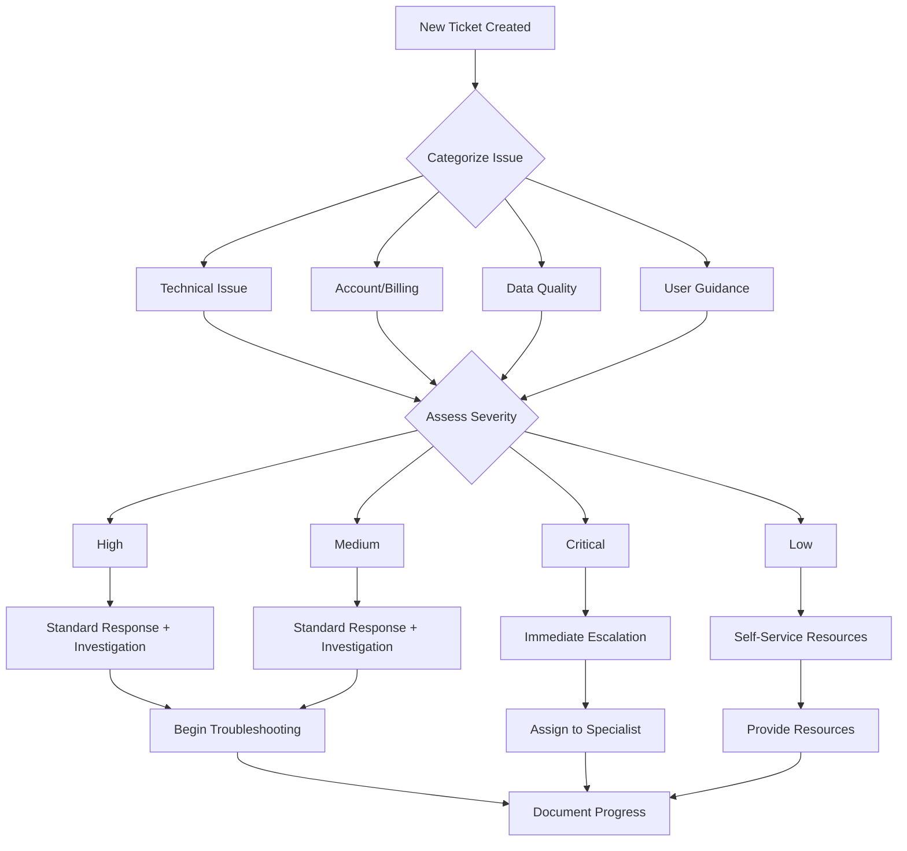
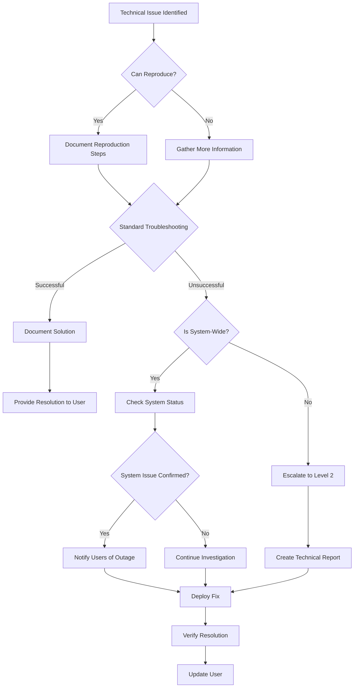
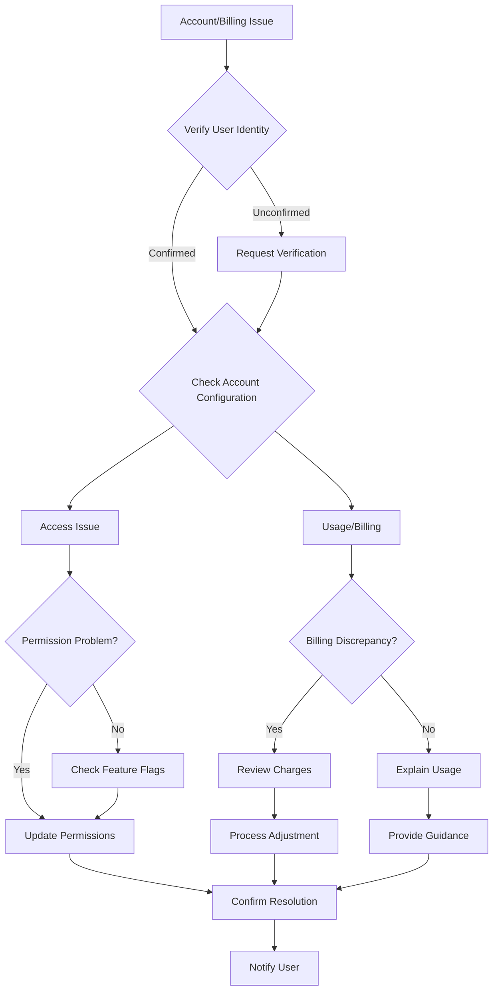
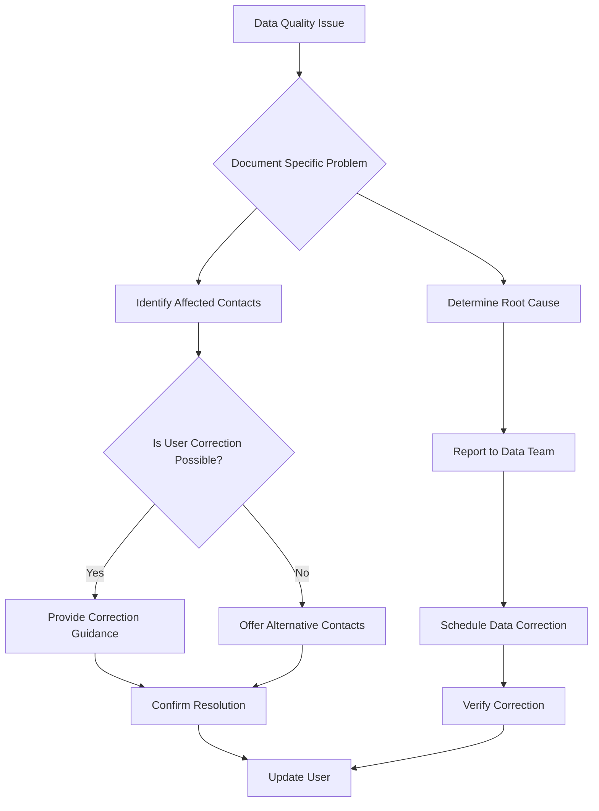

# Find Contacts with AI: Support Ticket Templates and Workflows

## Table of Contents
1. [Ticket Categorization System](#ticket-categorization-system)
2. [Support Ticket Templates](#support-ticket-templates)
3. [Ticket Workflows](#ticket-workflows)
4. [Escalation Procedures](#escalation-procedures)
5. [Internal Communication Templates](#internal-communication-templates)
6. [Quality Assurance Process](#quality-assurance-process)
7. [Performance Metrics](#performance-metrics)

## Ticket Categorization System

### Primary Categories

#### 1. Technical Issues
- **Search Failures**: Searches not completing or returning errors
- **Performance Issues**: Slow searches, timeouts, loading problems
- **Import/Export Failures**: Problems saving or transferring contacts
- **System Errors**: Unexpected behavior, error messages, crashes

#### 2. Account and Billing
- **Access Issues**: Feature not available, permission problems
- **Usage Limits**: Credit exhaustion, plan limitations
- **Billing Questions**: Charges, invoices, plan changes
- **Subscription Management**: Upgrades, downgrades, cancellations

#### 3. Data Quality
- **Incorrect Information**: Wrong contact details, outdated data
- **Missing Information**: Incomplete contact records
- **Duplicate Contacts**: Multiple entries for same person
- **Source Attribution**: Questions about where data comes from

#### 4. User Guidance
- **Feature Questions**: How to use specific functionality
- **Search Techniques**: Writing effective queries, using filters
- **Best Practices**: Optimizing search results, contact management
- **Training Requests**: Need for additional education or resources

### Severity Levels

#### Critical (Severity 1)
- System-wide outage affecting all users
- Security breach or data exposure
- Complete loss of functionality
- Financial transaction errors

#### High (Severity 2)
- Feature not working for multiple users
- Significant performance degradation
- Data corruption or loss
- Billing errors affecting payment

#### Medium (Severity 3)
- Individual user experiencing major issues
- Feature not working as designed
- Performance issues with workarounds available
- Data quality problems affecting business operations

#### Low (Severity 4)
- Minor usability issues
- Questions about feature functionality
- General guidance requests
- Cosmetic issues or documentation errors

## Support Ticket Templates

### 1. Initial Response Templates

#### Template 1.1: General Technical Issue
```
Subject: Re: Find Contacts with AI Issue - Ticket #[TICKET_NUMBER]

Dear [USER_NAME],

Thank you for contacting us about the "Find Contacts with AI" issue you're experiencing. 
I understand you're having trouble with [BRIEF_DESCRIPTION_OF_ISSUE].

I'm here to help you resolve this quickly. To get started, I'd like to ask a few questions:

1. What browser are you using? (Please ensure it's updated to the latest version)
2. Can you describe the exact steps you take when the issue occurs?
3. Are you seeing any error messages? If so, what do they say?
4. What specific query were you trying when the issue occurred?

In the meantime, please try these quick troubleshooting steps:
- Clear your browser cache and cookies
- Try using a different browser (Chrome, Firefox, Safari)
- Check if you have a stable internet connection
- Try a simpler search query to see if the issue persists

I'll review your responses and get back to you with a solution within [RESPONSE_TIME].

Best regards,
[SUPPORT_AGENT_NAME]
Customer Support Team
```

#### Template 1.2: Performance Issue
```
Subject: Re: Slow Search Performance - Ticket #[TICKET_NUMBER]

Dear [USER_NAME],

I understand you're experiencing slow performance with "Find Contacts with AI." 
I apologize for the inconvenience this is causing.

Search performance can vary based on several factors:
- Query complexity and length
- Current system load
- AI service provider response times
- Network connectivity

To help me diagnose the issue:
1. What specific query are you trying?
2. How long have you been waiting for results?
3. Does this happen with all searches or specific ones?
4. What time of day are you typically searching?

Try these optimization tips:
- Use more specific, focused queries
- Reduce the number of filters applied
- Search during off-peak hours (early morning or late evening)
- Try breaking complex searches into multiple simpler ones

I'll investigate potential system issues and get back to you with a solution within [RESPONSE_TIME].

Best regards,
[SUPPORT_AGENT_NAME]
Customer Support Team
```

#### Template 1.3: Account Access Issue
```
Subject: Re: Access to Find Contacts with AI - Ticket #[TICKET_NUMBER]

Dear [USER_NAME],

I understand you're having trouble accessing the "Find Contacts with AI" feature. 
Let me help you resolve this access issue.

First, let me verify your account details:
- Your current subscription plan: [USER_PLAN]
- Account status: [ACCOUNT_STATUS]
- Feature flags enabled: [FEATURE_FLAGS]

Common access issues include:
- Subscription plan limitations
- Feature flag configuration
- Account verification status
- Billing or payment issues

I'm checking your account configuration now. In the meantime:
- Verify your subscription includes AI Search
- Check if your account is fully verified
- Confirm you're logged in with the correct account

I'll get back to you with a solution within [RESPONSE_TIME].

Best regards,
[SUPPORT_AGENT_NAME]
Customer Support Team
```

#### Template 1.4: Billing Question
```
Subject: Re: Find Contacts with AI Billing Question - Ticket #[TICKET_NUMBER]

Dear [USER_NAME],

Thank you for contacting us about your billing question regarding "Find Contacts with AI."

I understand you have concerns about [SPECIFIC_BILLING_ISSUE]. Let me help clarify the cost structure and resolve any discrepancies.

How AI Search billing works:
- Each search consumes one credit
- Credit allocation varies by plan:
  * Free: 10 credits/month
  * Professional: 100 credits/month
  * Enterprise: Unlimited credits
- Credits reset on your billing date: [BILLING_DATE]

To address your specific concern:
1. What is your question about the charges?
2. Have you noticed unexpected usage?
3. Are you considering a plan change?

I'm reviewing your account usage and billing details now and will provide a complete explanation within [RESPONSE_TIME].

Best regards,
[SUPPORT_AGENT_NAME]
Customer Support Team
```

### 2. Progress Update Templates

#### Template 2.1: Investigation in Progress
```
Subject: Update on your Find Contacts with AI Issue - Ticket #[TICKET_NUMBER]

Dear [USER_NAME],

I wanted to provide you with an update on the issue you reported with "Find Contacts with AI."

Current Status:
[STATUS_UPDATE]

What I've done so far:
[ACTIONS_TAKEN]

Next steps:
[NEXT_STEPS]

I expect to have a resolution for you by [EXPECTED_TIME]. If you have any additional information that might help, please reply to this email.

Thank you for your patience as we work to resolve this for you.

Best regards,
[SUPPORT_AGENT_NAME]
Customer Support Team
```

#### Template 2.2: Escalation Notification
```
Subject: Update on your Find Contacts with AI Issue - Ticket #[TICKET_NUMBER]

Dear [USER_NAME],

I'm continuing to work on your "Find Contacts with AI" issue and have some updates for you.

After initial troubleshooting, I've determined this requires additional technical expertise. I've escalated your case to our technical support team who specialize in these types of issues.

What this means for you:
- A technical specialist is now reviewing your case
- They may contact you for additional information
- Resolution time may be extended slightly
- You'll receive continued updates on our progress

Current priority: [PRIORITY_LEVEL]
Expected resolution time: [TIMEFRAME]

I'll continue to monitor your case and ensure it receives the attention it deserves. Please don't hesitate to reach out if you have any questions.

Best regards,
[SUPPORT_AGENT_NAME]
Customer Support Team
```

### 3. Resolution Templates

#### Template 3.1: Issue Resolved
```
Subject: Your Find Contacts with AI Issue Has Been Resolved - Ticket #[TICKET_NUMBER]

Dear [USER_NAME],

Great news! I've resolved the "Find Contacts with AI" issue you were experiencing.

Issue Summary:
[ISSUE_SUMMARY]

Resolution Details:
[RESOLUTION_DETAILS]

The issue was caused by [ROOT_CAUSE]. To prevent this from happening again, I recommend:
[PREVENTION_TIPS]

I've also:
[ADDITIONAL_ACTIONS_TAKEN]

You should now be able to:
[WHAT_USER_CAN_DO_NOW]

If you experience any further issues or have questions about using "Find Contacts with AI," 
please don't hesitate to contact us. We're here to help 24/7.

Is there anything else I can help you with today?

Best regards,
[SUPPORT_AGENT_NAME]
Customer Support Team
```

#### Template 3.2: Workaround Provided
```
Subject: Workaround for Find Contacts with AI Issue - Ticket #[TICKET_NUMBER]

Dear [USER_NAME],

I've been working on the "Find Contacts with AI" issue you reported and wanted to provide you with a temporary solution while our engineering team works on a permanent fix.

Issue Summary:
[ISSUE_SUMMARY]

Temporary Workaround:
[WORKAROUND_INSTRUCTIONS]

This should allow you to:
[BENEFITS_OF_WORKAROUND]

Limitations to be aware of:
[WORKAROUND_LIMITATIONS]

Our engineering team is working on a permanent solution with an expected completion date of [EXPECTED_DATE]. I'll notify you as soon as the fix is deployed.

Please let me know if the workaround works for you or if you need any assistance with these steps.

Best regards,
[SUPPORT_AGENT_NAME]
Customer Support Team
```

### 4. Escalation Templates

#### Template 4.1: Level 2 Escalation
```
Subject: Escalation: Find Contacts with AI Issue - Ticket #[TICKET_NUMBER]

Dear [TECHNICAL_TEAM],

I'm escalating ticket #[TICKET_NUMBER] regarding [ISSUE_DESCRIPTION].

User Information:
- User ID: [USER_ID]
- Account Type: [ACCOUNT_TYPE]
- Issue Severity: [SEVERITY_LEVEL]
- Impact on User: [IMPACT_DESCRIPTION]

Troubleshooting Steps Taken:
[DETAILED_STEPS_WITH_RESULTS]

Issue Details:
[TECHNICAL_DETAILS]
[ERROR_MESSAGES]
[REPRODUCTION_STEPS]

System Status at Time of Issue:
[SYSTEM_STATUS_INFORMATION]

Customer Impact:
- Number of affected users: [COUNT]
- Business impact: [BUSINESS_IMPACT]
- User sentiment: [USER_SENTIMENT]

Please investigate and provide a resolution by [EXPECTED_RESOLUTION_TIME].

Best regards,
[SUPPORT_AGENT_NAME]
Customer Support Team
```

#### Template 4.2: Engineering Escalation
```
Subject: Engineering Escalation: Find Contacts with AI - Ticket #[TICKET_NUMBER]

Dear [ENGINEERING_TEAM],

I'm escalating ticket #[TICKET_NUMBER] for engineering intervention regarding [ISSUE_DESCRIPTION].

Issue Summary:
[SUMMARY_OF_PROBLEM]

Technical Details:
[TECHNICAL_ANALYSIS]
[ERROR_LOGS]
[SYSTEM_METRICS]

Reproduction Steps:
[DETAILED_REPRODUCTION_STEPS]

Impact Assessment:
- User Impact: [USER_IMPACT]
- Business Impact: [BUSINESS_IMPACT]
- System Impact: [SYSTEM_IMPACT]

Urgency Level: [URGENCY]
Expected Resolution Time: [TIMEFRAME]

Previous Troubleshooting:
[PREVIOUS_ATTEMPTS]

Please prioritize this issue based on the impact assessment and provide regular updates on progress.

Best regards,
[SUPPORT_AGENT_NAME]
Customer Support Team
```

## Ticket Workflows

### 1. Initial Triage Workflow



### 2. Technical Issue Workflow



### 3. Account/Billing Workflow



### 4. Data Quality Workflow



## Escalation Procedures

### 1. Escalation Triggers

#### Immediate Escalation (Within 1 Hour)
- System-wide outage or degradation
- Security breach or data exposure
- Financial transaction errors
- Legal compliance issues
- Data corruption or loss

#### Standard Escalation (Within 4 Hours)
- Issue unresolved after standard troubleshooting
- Technical complexity beyond support scope
- Feature not working as designed
- Multiple users affected by same issue
- Revenue impact exceeding $[AMOUNT]

#### Delayed Escalation (Within 24 Hours)
- Recurring issues with same user
- Complex user configuration problems
- Feature requests requiring technical evaluation
- Process improvement suggestions

### 2. Escalation Process

#### Step 1: Initial Assessment
1. Determine if issue meets escalation criteria
2. Assess business impact and urgency
3. Identify appropriate escalation level
4. Gather all relevant information and documentation

#### Step 2: Internal Notification
1. Notify team lead of escalation
2. Create comprehensive escalation ticket
3. Assign appropriate priority level
4. Set expected resolution timeframe

#### Step 3: Escalation Execution
1. Transfer to appropriate team or specialist
2. Provide complete context and background
3. Establish communication protocol
4. Monitor progress and provide updates

#### Step 4: Follow-Up
1. Verify resolution meets requirements
2. Update original ticket with resolution
3. Communicate resolution to user
4. Document lessons learned

### 3. Escalation Communication

#### Internal Escalation Template
```
Subject: Escalation Request: [ISSUE_TYPE] - Ticket #[TICKET_NUMBER]

Issue Type: [ISSUE_CATEGORY]
Severity: [SEVERITY_LEVEL]
User Impact: [IMPACT_DESCRIPTION]

Problem Summary:
[PROBLEM_DESCRIPTION]

Troubleshooting Attempted:
[TROUBLESHOOTING_STEPS]

Business Impact:
[BUSINESS_IMPACT]

Required Action:
[REQUESTED_ACTION]

Time Sensitivity: [TIME_SENSITIVITY]

Please acknowledge receipt and provide ETA for resolution.
```

#### External Escalation Notification
```
Subject: Update on Your Support Ticket #[TICKET_NUMBER]

Dear [USER_NAME],

I wanted to update you on your support ticket regarding [ISSUE_DESCRIPTION].

After initial troubleshooting, I've determined this requires specialized attention. I've escalated your case to our [TEAM_NAME] team who are experts in this area.

What this means:
- A specialist is now reviewing your case
- They may contact you for additional information
- Resolution time may be extended
- You'll receive regular updates on progress

I'll personally monitor your case to ensure it receives the attention it deserves. Your issue is important to us, and we're committed to resolving it completely.

Thank you for your patience and understanding.

Best regards,
[SUPPORT_AGENT_NAME]
Customer Support Team
```

## Internal Communication Templates

### 1. Team Handoff Template

```
Subject: Handoff: Find Contacts with AI - Ticket #[TICKET_NUMBER]

Team Member: [CURRENT_AGENT] → [NEXT_AGENT]
User: [USER_NAME] ([USER_ID])
Issue: [BRIEF_DESCRIPTION]
Status: [CURRENT_STATUS]

Actions Taken:
[ACTIONS_TAKEN]

Current Status:
[CURRENT_STATUS]

Next Steps:
[NEXT_STEPS]

User Preferences:
- Communication method: [EMAIL/PHONE/CHAT]
- Best contact times: [TIMES]
- Time zone: [TIMEZONE]

Notes:
[ADDITIONAL_NOTES]

Please acknowledge receipt and confirm handoff.
```

### 2. Shift Handoff Template

```
Subject: Shift Handoff - [DATE]

Open Tickets Requiring Attention:
[TICKET_LIST_WITH_BRIEF_SUMMARY]

System Status:
[SYSTEM_STATUS_INFORMATION]

Known Issues:
[KNOWN_ISSUES_AND_STATUS]

Follow-Up Items:
[ITEMS_REQUIRING_FOLLOW_UP]

Team Notes:
[TEAM_NOTES_AND_UPDATES]

Please review all open tickets and continue as appropriate.
```

### 3. Knowledge Base Contribution Template

```
Subject: Knowledge Base Contribution: [TOPIC]

Issue:
[ISSUE_DESCRIPTION]

Solution:
[SOLUTION_STEPS]

Root Cause:
[ROOT_CAUSE_ANALYSIS]

Prevention:
[PREVENTION_TIPS]

Tags:
[RELEVANT_TAGS]

Related Articles:
[RELATED_ARTICLES]

Please review and publish to knowledge base.
```

## Quality Assurance Process

### 1. Ticket Review Checklist

#### Initial Response Quality
- [ ] Response sent within SLA timeframe
- [ ] Tone is professional and empathetic
- [ ] Technical explanation is clear and simple
- [ ] Next steps are clearly outlined
- [ ] Ticket is properly categorized

#### Technical Accuracy
- [ ] Troubleshooting steps are correct
- [ ] Technical explanations are accurate
- [ ] Root cause is correctly identified
- [ ] Solution addresses the issue
- [ ] Escalation is appropriate when used

#### Communication Quality
- [ ] Grammar and spelling are correct
- [ ] Formatting is clear and readable
- [ ] Technical terms are explained simply
- [ ] User questions are fully answered
- [ ] Follow-up expectations are set

### 2. QA Review Process

#### Peer Review
1. Senior agent reviews new agent tickets weekly
2. Focus on communication quality and technical accuracy
3. Provide constructive feedback and coaching
4. Track improvement over time

#### Team Lead Review
1. Monthly review of all agent performance
2. Identify trends and common issues
3. Develop team training recommendations
4. Recognize excellent performance

#### Self-Review
1. Agents review their own tickets monthly
2. Identify areas for personal improvement
3. Set professional development goals
4. Seek additional training as needed

### 3. Performance Metrics

#### Quality Metrics
- **Customer Satisfaction Score (CSAT)**: Target > 4.5/5.0
- **First Contact Resolution Rate**: Target > 80%
- **Ticket Reopen Rate**: Target < 5%
- **Knowledge Base Contribution Rate**: Target > 10%

#### Efficiency Metrics
- **Average Response Time**: Target < 2 hours
- **Average Resolution Time**: Target < 24 hours
- **Tickets per Agent per Day**: Target 15-25
- **Knowledge Base Usage Rate**: Target > 60%

#### Effectiveness Metrics
- **Issue Resolution Rate**: Target > 95%
- **Escalation Rate**: Target < 15%
- **Customer Retention Rate**: Target > 95%
- **Net Promoter Score (NPS)**: Target > 70

---

## Related Resources

- [Find Contacts with AI Comprehensive Support Guide](find-contacts-with-ai-comprehensive-support-guide.md)
- [Find Contacts with AI Troubleshooting Guide](find-contacts-with-ai-troubleshooting-guide.md)
- [Support Team Training Program](find-contacts-with-ai-support-training-program.md)
- [System Status Dashboard](/status/find-contacts-with-ai)
- [Support Knowledge Base](/support/knowledge-base)

---

*Last updated: October 11, 2023*  
*For the most current information, check the internal knowledge base or contact the support team lead.*