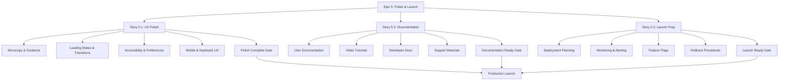

# Epic 5: Polish & Launch - Summary

## Overview
This document provides a summary of the newly created Epic 5: Polish & Launch components and how they integrate with the existing implementation plan.

## Created Components

### 1. Epic Definition Document
**File**: `plan/find-contacts/epics/epic-5-polish-launch.md`

This comprehensive epic definition includes:
- Epic overview and business value
- Clear boundaries and scope definition
- Detailed acceptance criteria
- Dependencies and risk assessment
- Timeline and resource requirements
- Quality gates and success metrics
- User experience polish strategy
- Documentation strategy
- Launch strategy

### 2. Story Documents

#### Story 5.1: User Experience Polish
**File**: `plan/find-contacts/stories/epic-5-polish-launch/story-5.1-user-experience-polish.md`

Focus areas:
- Microcopy improvements and user guidance
- Loading states and transitions
- Accessibility enhancements
- User preferences and settings
- Mobile experience optimization
- Keyboard shortcuts

#### Story 5.2: Documentation and Training
**File**: `plan/find-contacts/stories/epic-5-polish-launch/story-5.2-documentation-training.md`

Focus areas:
- User documentation and guides
- Video tutorials and training materials
- Developer documentation
- Support documentation
- Training materials for teams

#### Story 5.3: Launch Preparation
**File**: `plan/find-contacts/stories/epic-5-polish-launch/story-5.3-launch-preparation.md`

Focus areas:
- Production deployment preparation
- Monitoring and alerting systems
- Feature flags and gradual rollout
- Rollback procedures
- Cost management and monitoring
- Launch communication plan

## Integration with Implementation Tasks

The Epic 5 tasks in `implementation-tasks.mdc` (lines 580-714) are now fully supported by:

1. **Task 5.1: User Experience Polish** → Story 5.1
2. **Task 5.2: Documentation and Training** → Story 5.2
3. **Task 5.3: Launch Preparation** → Story 5.3

Each story provides detailed implementation guidance, acceptance criteria, testing requirements, and success metrics that expand on the task definitions in the implementation tasks document.

## Key Benefits of the New Epic 5 Components

### Comprehensive Planning
- Detailed epic definition with clear boundaries and success criteria
- Risk assessment and mitigation strategies
- Resource planning and timeline estimation

### Implementation Clarity
- Story-level detail for each major work stream
- Specific acceptance criteria and definition of done
- Testing requirements and success metrics

### Better Coordination
- Clear dependencies between work streams
- Integrated timeline and milestone planning
- Coordinated launch strategy

### Quality Assurance
- Quality gates and go/no-go criteria
- Comprehensive testing strategies
- Success metrics and monitoring plans

## Next Steps

1. Review all Epic 5 components for completeness and accuracy
2. Validate integration with existing epics and dependencies
3. Approve the Epic 5 plan for implementation
4. Begin execution of Story 5.1: User Experience Polish

## Files Created

1. `plan/find-contacts/epics/epic-5-polish-launch.md` - Epic definition
2. `plan/find-contacts/stories/epic-5-polish-launch/story-5.1-user-experience-polish.md` - User experience story
3. `plan/find-contacts/stories/epic-5-polish-launch/story-5.2-documentation-training.md` - Documentation story
4. `plan/find-contacts/stories/epic-5-polish-launch/story-5.3-launch-preparation.md` - Launch preparation story

## Mermaid Diagram: Epic 5 Workflow

This Epic 5 structure provides a comprehensive framework for polishing the Find Contacts with AI feature and ensuring a successful production launch.