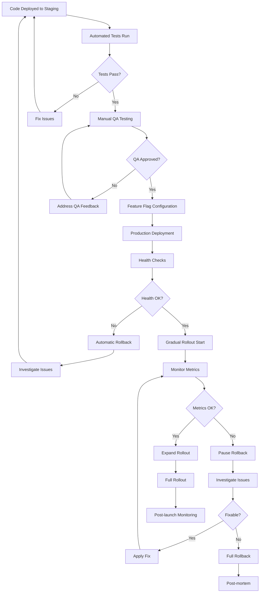

# Story 5.3: Launch Preparation
**Epic**: Epic 5: Polish & Launch
**Estimated Time**: 2 days
**Priority**: High
**Status**: Pending
**Assignee**: DevOps Engineer + Product Manager

## Objective
Prepare for the production launch of the Find Contacts with AI feature including deployment procedures, monitoring systems, feature flags, and rollback plans. This story ensures a smooth, controlled launch with proper monitoring and the ability to respond quickly to any issues.

## Acceptance Criteria
- [ ] Production deployment plan is tested and verified
- [ ] Monitoring captures all critical metrics and performance indicators
- [ ] Feature flags enable safe gradual rollout to users
- [ ] Rollback procedures are tested and documented
- [ ] Analytics provide meaningful insights into feature usage
- [ ] Support team is trained and resources are prepared
- [ ] Cost monitoring prevents unexpected overages
- [ ] Launch announcement materials are prepared and approved
- [ ] A/B testing framework is functional and configured
- [ ] Launch timeline is communicated to all stakeholders
- [ ] Post-launch monitoring plan is established and functional
- [ ] Success metrics are defined and tracking is implemented

## Technical Requirements

### Deployment Infrastructure
- **Production Environment**: Fully configured and tested production environment
- **Deployment Pipeline**: Automated CI/CD pipeline with proper stages
- **Database Migrations**: Production-ready migration scripts
- **Configuration Management**: Environment-specific configurations
- **Secret Management**: Secure handling of API keys and credentials

### Monitoring and Alerting
- **Application Monitoring**: Real-time application performance monitoring
- **Database Monitoring**: Query performance and connection monitoring
- **Infrastructure Monitoring**: Server and resource utilization monitoring
- **Error Tracking**: Comprehensive error logging and alerting
- **User Analytics**: Feature usage and user behavior tracking

### Feature Flag System
- **Gradual Rollout**: Ability to enable feature for percentage of users
- **User Segmentation**: Target specific user groups for testing
- **Instant Disable**: Ability to disable feature immediately if needed
- **A/B Testing**: Framework for testing different configurations
- **Performance Monitoring**: Track performance impact of feature flags

### Rollback Procedures
- **Database Rollback**: Ability to reverse database changes safely
- **Application Rollback**: Quick rollback to previous application version
- **Configuration Rollback**: Revert configuration changes if needed
- **Data Recovery**: Procedures for recovering lost or corrupted data
- **Communication Plan**: Templates for communicating rollback incidents

### Cost Management
- **Usage Monitoring**: Real-time tracking of API costs and usage
- **Budget Alerts**: Alerts when costs approach budget limits
- **Cost Optimization**: Automatic cost optimization where possible
- **Usage Reports**: Regular reports on feature costs and ROI
- **Rate Limiting**: Prevent unexpected cost spikes

## Implementation Details

### Deployment Process

### Monitoring Dashboard
- **Key Performance Indicators**: Search success rate, response time, error rate
- **User Metrics**: Feature adoption, usage patterns, user satisfaction
- **System Metrics**: CPU, memory, database performance, API costs
- **Business Metrics**: Contact discovery rate, user time savings, ROI
- **Alert Thresholds**: Configurable alerts for critical metrics

### Launch Strategy
1. **Internal Testing**: Feature enabled for internal team only
2. **Beta Release**: Feature enabled for select customers (5-10%)
3. **Limited Rollout**: Feature enabled for larger group (25-50%)
4. **Full Rollout**: Feature enabled for all users
5. **Post-launch**: Continuous monitoring and optimization

### Communication Plan
- **Pre-launch**: Internal team communication and training
- **Beta Launch**: Communication to beta testers with feedback channels
- **Limited Rollout**: Announcement to affected users with support information
- **Full Launch**: Public announcement with comprehensive launch materials
- **Post-launch**: Regular updates on feature performance and improvements

## Definition of Done
- Production deployment plan is tested and verified in staging
- All monitoring and alerting systems are functional
- Feature flags are configured and tested
- Rollback procedures are documented and tested
- Support team is trained and resources are available
- Launch announcement materials are prepared and approved
- Cost monitoring is configured with appropriate alerts
- A/B testing framework is functional
- All stakeholders are informed of launch timeline
- Post-launch monitoring plan is established

## Testing Requirements

### Deployment Testing
- Test complete deployment process in staging environment
- Verify rollback procedures work correctly
- Test feature flag configuration and operation
- Validate monitoring and alerting systems
- Test communication channels and procedures

### Performance Testing
- Load testing with expected user traffic
- Stress testing beyond expected limits
- Performance testing with feature enabled/disabled
- Database performance under load
- API rate limiting and cost controls

### Security Testing
- Security scan of production deployment
- Penetration testing of feature endpoints
- Validation of secure configuration
- Testing of authentication and authorization
- Verification of data protection measures

## Success Metrics
- Launch success: Zero critical issues in first 24 hours
- Feature stability: >99.9% uptime in first week
- Performance maintained: All benchmarks met post-launch
- User adoption: >60% of active users try feature within first month
- Support efficiency: <2% of users require support assistance
- Cost control: No unexpected cost overages

## Risk Mitigation
- **Deployment Issues**: Thorough testing in staging, automated rollback
- **Performance Problems**: Comprehensive monitoring, gradual rollout
- **User Adoption Issues**: Clear communication, user support, documentation
- **Cost Overruns**: Real-time monitoring, automated alerts, rate limiting
- **Security Vulnerabilities**: Security testing, continuous monitoring

## Resource Requirements
- **DevOps Engineer**: Lead deployment preparation and infrastructure setup
- **Product Manager**: Coordinate launch activities and stakeholder communication
- **Backend Developer**: Support deployment and monitoring configuration
- **Frontend Developer**: Support feature flag configuration and testing
- **QA Engineer**: Test deployment procedures and validate functionality
- **Support Team**: Prepare for user support and issue resolution

## Emergency Procedures
- **Critical Issues**: Immediate rollback and incident response
- **Performance Degradation**: Scale resources and optimize queries
- **Security Incidents**: Immediate disable and security response
- **Cost Spikes**: Immediate rate limiting and cost controls
- **User Issues**: Rapid response and communication

## Related Documentation
- [Epic 5: Polish & Launch](../../epics/epic-5-polish-launch.md)
- [Implementation Tasks](../../implementation-tasks.mdc#task-53-launch-preparation)
- [Deployment Guide](../../../docs/deployment.md)
- [Monitoring Strategy](../../../docs/monitoring.md)
- [Incident Response Plan](../../../docs/incident-response.md)